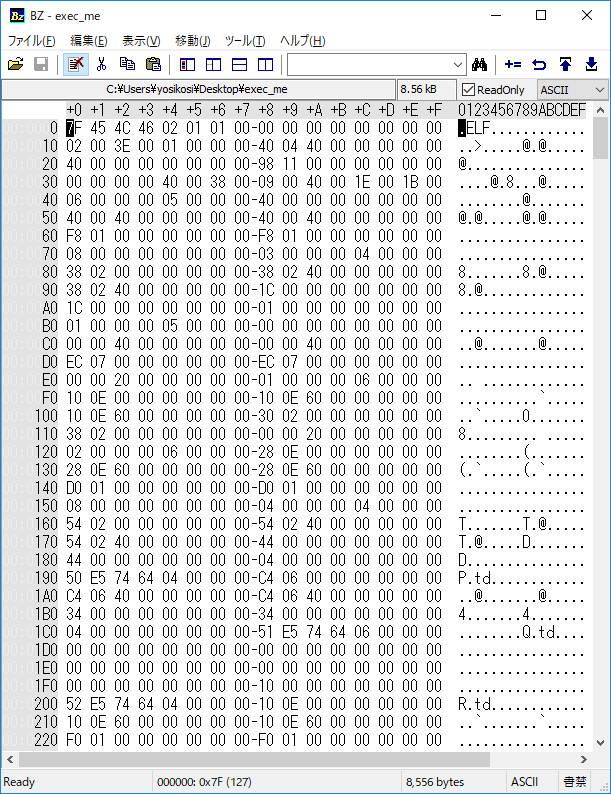

# 解答
適切なOSでファイルを実行するだけ。
ファイル形式を知るためにはlinuxなら、fileコマンドを使えばよい。

```bash
$file exec_me
exec_me: ELF 64-bit LSB executable, x86-64, version 1 (SYSV), dynamically linked, interpreter /lib64/ld-linux-x86-64.so.2, for GNU/Linux 2.6.24, BuildID[sha1]=663a3e0e5a079fddd0de92474688cd6812d3b550, not stripped
```

ファイルはELFの64bitらしい。
ELFはlinuxやBSD系で使われる実行ファイル。
* linuxには拡張子と言う概念はありません。

[wikipedia参照](https://ja.wikipedia.org/wiki/Executable_and_Linkable_Format)

因みに、windowsで動く拡張子exeはPEファイルである

[wikipedia参照](https://ja.wikipedia.org/wiki/Portable_Executable)

```bash
$ ./exec_me
cpaw{Do_you_know_ELF_file?}
```

フラグゲット。

因みに、マジックナンバーを見るという手もある。
例えば、今回のELFファイルはBZで確認すると、一番初めのasciiが**ELF**になるようになっている。



