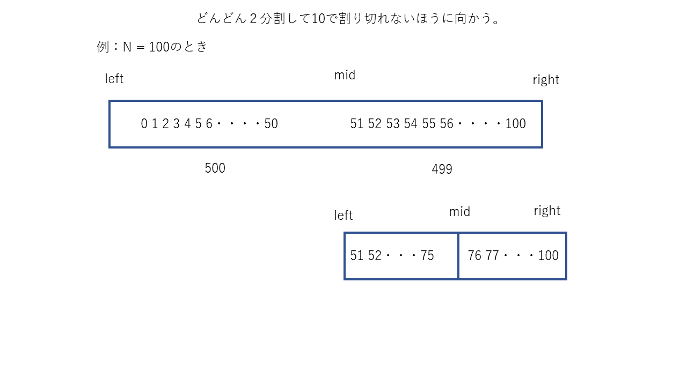

# 内容
まず指定された通り、ncでサーバに入る

```bash
pwnable.kr 9007

        ---------------------------------------------------
        -              Shall we play a game?              -
        ---------------------------------------------------

        You have given some gold coins in your hand
        however, there is one counterfeit coin among them
        counterfeit coin looks exactly same as real coin
        however, its weight is different from real one
        real coin weighs 10, counterfeit coin weighes 9
        help me to find the counterfeit coin with a scale
        if you find 100 counterfeit coins, you will get reward :)
        FYI, you have 60 seconds.

        - How to play -
        1. you get a number of coins (N) and number of chances (C)
        2. then you specify a set of index numbers of coins to be weighed
        3. you get the weight information
        4. 2~3 repeats C time, then you give the answer

        - Example -
        [Server] N=4 C=2        # find counterfeit among 4 coins with 2 trial
        [Client] 0 1            # weigh first and second coin
        [Server] 20                     # scale result : 20
        [Client] 3                      # weigh fourth coin
        [Server] 10                     # scale result : 10
        [Client] 2                      # counterfeit coin is third!
        [Server] Correct!

        - Ready? starting in 3 sec... -

N=435 C=9
1 2 3 4 5 6 7 8 9 10 11
110
```

私の知識で翻訳するとこんな感じになる。
```
いくつかのゴールドコインを持っています。
しかし、一つの偽のコインあります。本物のコインとまったく同じように(外見一緒ってこと？)。
しかし、重さが違います。本物は重さ10、偽物は重さ9です。
手伝ってください、scaleで見つけるのを(scaleってなに？定規？)。
100個偽コインを見つけたら、報酬を得られます。
60秒で見つけてください。

- How to play-
1. コインの数[N]と選べる回数[C]
2. コインのインデックス(複数)を指定する
3. あなたは重さの情報を得ます
4. 2～3を繰り返します。あなたは答えを与えます
```

こんな英語で大丈夫か？大丈夫なわけがない・・・。
まぁそれは置いておいて、内容はある程度理解した。

# 解答

10で割り切れないほうに向かえばよい。



とりあえずpythonでスクリプトを書いていく。

```python
mport socket
import time
import re


def sol2(client, cnt):
  res = client.recv(2 ** 4)
  print(res)

  N = re.search(rb'N=([0-9]+)' , res).group(1).decode('utf-8')
  C = re.search(rb'C=([0-9]+)' , res).group(1).decode('utf-8')
  print("N = " + str(N) + ", C = " + str(C) )


  left = 0
  right = int(N)
  mid = int(int(N)/2)

  i = left
  j = mid + 1
  
  for chanceCnt in range(1, int(C) + 2 ):
    print("chance = " + str(chanceCnt) )
    msg = ""
    for indexCnt in range(i, j):
      msg += str(indexCnt) + " "
    print("msg = " + msg)
    msg += "\n"
    client.send( msg.encode('utf-8') )
    res = client.recv(2 ** 4).decode('utf-8')
    #res = re.search(rb'[0-9]+' , res).group(0).decode('utf-8')
    print("responce = " + str(res).replace("\n", "") )

    if res.find("Correct!") != -1:
      break
    if int(res)%10 == 0:
      i = j
      j = j + int((right-j)/2)
    elif int(res) == 9:
      continue
    else:
      right = j
      j = i + int( (j - i) / 2 )

    if i == j and j != right:
      j += 1
    if i == j  and j == right:
      i -= 1
    print("i = " + str(i) + ", j = " + str(j) + ", right = " + str(right) + "\n")

def sol():
  port = 9007
  host = "pwnable.kr"
  client = socket.socket(socket.AF_INET, socket.SOCK_STREAM)
  client.connect((host, port))
  res = client.recv(2 ** 11)
  cnt = 0
  while True:
    print(str(cnt))
    sol2(client, cnt)
    cnt += 1
    if cnt > 99:
      res = client.recv(2 ** 11).decode('utf-8')
      print(res)
      break
  client.close()

def main():
  sol()

if __name__ == '__main__':
  main()
```

しかし、うまくいかない。

```bash
$ python3 sol.py
・
・
・
省略
・
・
・
chance = 8
msg = 3
responce = 9
chance = 9
msg = 3
responce = Correct! (32)
33
b'N=143 C=8\n'
N = 143, C = 8
chance = 1
msg = 0 1 2 3 4 5 6 7 8 9 10 11 12 13 14 15 16 17 18 19 20 21 22 23 24 25 26 27 28 29 30 31 32 33 34 35 36 37 38 39 40 41 42 43 44 45 46 47 48 49 50 51 52 53 54 55 56 57 58 59 60 61 62 63 64 65 66 67 68 69 70 71
responce = time expired! by
Traceback (most recent call last):
  File "sol.py", line 74, in <module>
    main()
  File "sol.py", line 71, in main
    sol()
  File "sol.py", line 62, in sol
    sol2(client, cnt)
  File "sol.py", line 37, in sol2
    if int(res)%10 == 0:
ValueError: invalid literal for int() with base 10: 'time expired! by'
```

どうやら、時間が足りないようだ。
ここで、ものすごい悩む。
どうやっても、制限時間の60秒以内に終了する気がしない・・・。
どうしたものかと考えていたら、最初にヒントが書いてあった。

```
Mommy, I wanna play a game!
(if your network response time is too slow, try nc 0 9007 inside pwnable.kr server)
```

なるほど、確かにローカルなら処理速度早いわな。
ということで、スクリプトファイルの部分のipアドレスを以下のように変えて、サーバー内で実行する。

```python
#host = "pwnable.kr"
host = '127.0.0.1'
```

ログインするサーバーはどこでもよいと思われる。
今回はfd@pwnable.krにsshで接続して、スクリプトファイルを実行した。


```bash____  __    __  ____    ____  ____   _        ___      __  _  ____
$ ssh fd@pwnable.kr -p2222
fd@pwnable.kr's password:
 ____  __    __  ____    ____  ____   _        ___      __  _  ____
|    \|  |__|  ||    \  /    ||    \ | |      /  _]    |  |/ ]|    \
|  o  )  |  |  ||  _  ||  o  ||  o  )| |     /  [_     |  ' / |  D  )
|   _/|  |  |  ||  |  ||     ||     || |___ |    _]    |    \ |    /
|  |  |  `  '  ||  |  ||  _  ||  O  ||     ||   [_  __ |     \|    \
|  |   \      / |  |  ||  |  ||     ||     ||     ||  ||  .  ||  .  \
|__|    \_/\_/  |__|__||__|__||_____||_____||_____||__||__|\_||__|\_|

- Site admin : daehee87.kr@gmail.com
- IRC : irc.netgarage.org:6667 / #pwnable.kr
- Simply type "irssi" command to join IRC now
- files under /tmp can be erased anytime. make your directory under /tmp
- to use peda, issue `source /usr/share/peda/peda.py` in gdb terminal
Last login: Thu Jul 25 02:44:49 2019 from 118.238.217.72
fd@prowl:~$
fd@prowl:~$
fd@prowl:~$ mkdir /tmp/uuuuu
fd@prowl:~$ cd /tmp/uuuuu
fd@prowl:~$ exit
$ scp -P2222 ./sol.py fd@pwnable.kr:/tmp/uuuuu/
fd@pwnable.kr's password:
sol.py                       100% 1600     9.7KB/s   00:00

$ ssh fd@pwnable.kr -p2222
fd@pwnable.kr's password:
 ____  __    __  ____    ____  ____   _        ___      __  _  ____
|    \|  |__|  ||    \  /    ||    \ | |      /  _]    |  |/ ]|    \
|  o  )  |  |  ||  _  ||  o  ||  o  )| |     /  [_     |  ' / |  D  )
|   _/|  |  |  ||  |  ||     ||     || |___ |    _]    |    \ |    /
|  |  |  `  '  ||  |  ||  _  ||  O  ||     ||   [_  __ |     \|    \
|  |   \      / |  |  ||  |  ||     ||     ||     ||  ||  .  ||  .  \
|__|    \_/\_/  |__|__||__|__||_____||_____||_____||__||__|\_||__|\_|

- Site admin : daehee87.kr@gmail.com
- IRC : irc.netgarage.org:6667 / #pwnable.kr
- Simply type "irssi" command to join IRC now
- files under /tmp can be erased anytime. make your directory under /tmp
- to use peda, issue `source /usr/share/peda/peda.py` in gdb terminal
Last login: Thu Jul 25 03:59:35 2019 from 118.238.217.72
fd@prowl:~$ cd /tmp/uuuuu
fd@prowl:~$d@prowl:/tmp/uuuuu$ python3 sol.py
・
・
・
省略
・
・
・
ance = 11
msg = 496
responce = Correct! (98)
99
b'N=705 C=10\n'
N = 705, C = 10
chance = 1
msg = 0 1 2 3 4 5 6 7 8 9 10 11 12 13 14 15 16 17 18 19 20 21 22 23 24 25 26 27 28 29 30 31 32 33 34 35 36 37 38 39 40 41 42 43 44 45 46 47 48 49 50 51 52 53 54 55 56 57 58 59 60 61 62 63 64 65 66 67 68 69 70 71 72 73 74 75 76 77 78 79 80 81 82 83 84 85 86 87 88 89 90 91 92 93 94 95 96 97 98 99 100 101 102 103 104 105 106 107 108 109 110 111 112 113 114 115 116 117 118 119 120 121 122 123 124 125 126 127 128 129 130 131 132 133 134 135 136 137 138 139 140 141 142 143 144 145 146 147 148 149 150 151 152 153 154 155 156 157 158 159 160 161 162 163 164 165 166 167 168 169 170 171 172 173 174 175 176 177 178 179 180 181 182 183 184 185 186 187 188 189 190 191 192 193 194 195 196 197 198 199 200 201 202 203 204 205 206 207 208 209 210 211 212 213 214 215 216 217 218 219 220 221 222 223 224 225 226 227 228 229 230 231 232 233 234 235 236 237 238 239 240 241 242 243 244 245 246 247 248 249 250 251 252 253 254 255 256 257 258 259 260 261 262 263 264 265 266 267 268 269 270 271 272 273 274 275 276 277 278 279 280 281 282 283 284 285 286 287 288 289 290 291 292 293 294 295 296 297 298 299 300 301 302 303 304 305 306 307 308 309 310 311 312 313 314 315 316 317 318 319 320 321 322 323 324 325 326 327 328 329 330 331 332 333 334 335 336 337 338 339 340 341 342 343 344 345 346 347 348 349 350 351 352
responce = 3530
i = 353, j = 529, right = 705

chance = 2
msg = 353 354 355 356 357 358 359 360 361 362 363 364 365 366 367 368 369 370 371 372 373 374 375 376 377 378 379 380 381 382 383 384 385 386 387 388 389 390 391 392 393 394 395 396 397 398 399 400 401 402 403 404 405 406 407 408 409 410 411 412 413 414 415 416 417 418 419 420 421 422 423 424 425 426 427 428 429 430 431 432 433 434 435 436 437 438 439 440 441 442 443 444 445 446 447 448 449 450 451 452 453 454 455 456 457 458 459 460 461 462 463 464 465 466 467 468 469 470 471 472 473 474 475 476 477 478 479 480 481 482 483 484 485 486 487 488 489 490 491 492 493 494 495 496 497 498 499 500 501 502 503 504 505 506 507 508 509 510 511 512 513 514 515 516 517 518 519 520 521 522 523 524 525 526 527 528
responce = 1759
i = 353, j = 441, right = 529

chance = 3
msg = 353 354 355 356 357 358 359 360 361 362 363 364 365 366 367 368 369 370 371 372 373 374 375 376 377 378 379 380 381 382 383 384 385 386 387 388 389 390 391 392 393 394 395 396 397 398 399 400 401 402 403 404 405 406 407 408 409 410 411 412 413 414 415 416 417 418 419 420 421 422 423 424 425 426 427 428 429 430 431 432 433 434 435 436 437 438 439 440
responce = 879
i = 353, j = 397, right = 441

chance = 4
msg = 353 354 355 356 357 358 359 360 361 362 363 364 365 366 367 368 369 370 371 372 373 374 375 376 377 378 379 380 381 382 383 384 385 386 387 388 389 390 391 392 393 394 395 396
responce = 439
i = 353, j = 375, right = 397

chance = 5
msg = 353 354 355 356 357 358 359 360 361 362 363 364 365 366 367 368 369 370 371 372 373 374
responce = 219
i = 353, j = 364, right = 375

chance = 6
msg = 353 354 355 356 357 358 359 360 361 362 363
responce = 109
i = 353, j = 358, right = 364

chance = 7
msg = 353 354 355 356 357
responce = 49
i = 353, j = 355, right = 358

chance = 8
msg = 353 354
responce = 20
i = 355, j = 356, right = 358

chance = 9
msg = 355
responce = 10
i = 356, j = 357, right = 358

chance = 10
msg = 356
responce = 9
chance = 11
msg = 356
responce = Correct! (99)
Congrats! get your flag
```

フラグゲット
