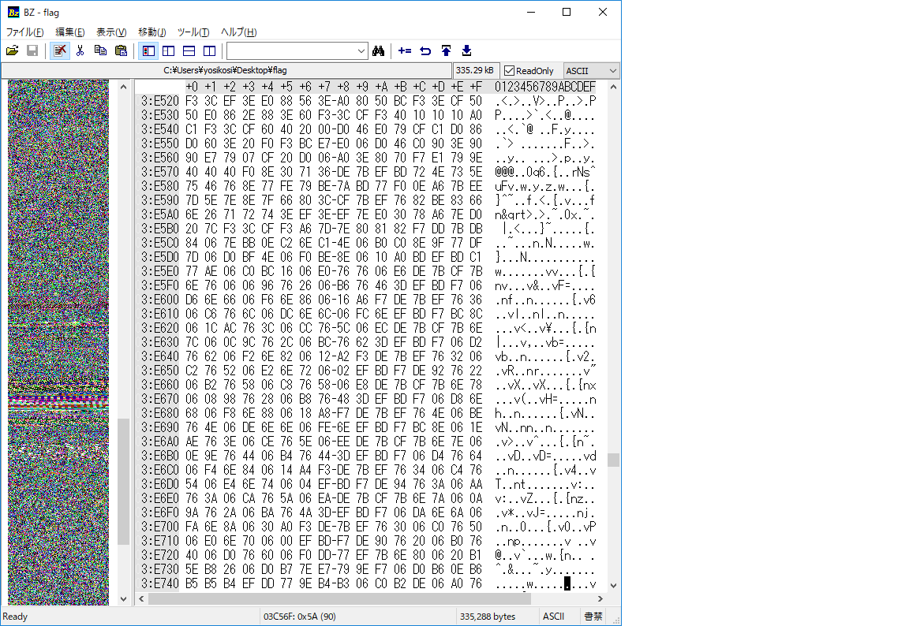
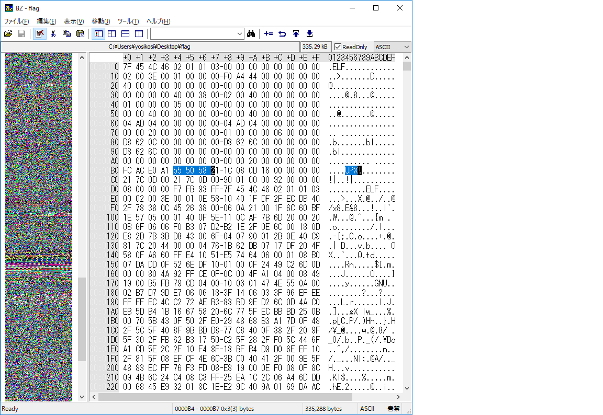
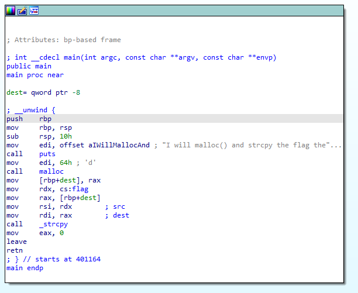
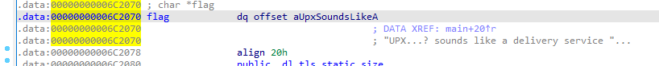
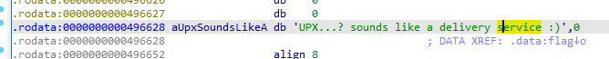
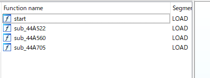
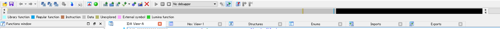
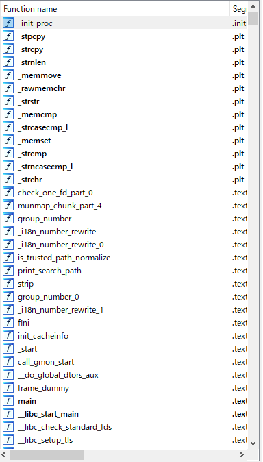
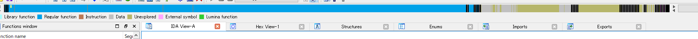

# 問題内容
flagとい64bitのelfファイルがパックされているから何とかしてunpackしろって問題かな？

# 手順
まず、stringsをかけて難読化されているか確認する。
ここには載せないが、よくわからない文字列がたくさん出てきた。
次は、BZでbitmapを見てみる。
エントロピーが高いのがうかがえる。



というか、bzながめてたら、UPXって文字があった・・・。



ということで、upxでアンパックする

```bash
$ upx -d flag
                       Ultimate Packer for eXecutables
                          Copyright (C) 1996 - 2013
UPX 3.91        Markus Oberhumer, Laszlo Molnar & John Reiser   Sep 30th 2013

        File size         Ratio      Format      Name
   --------------------   ------   -----------   -----------
    887219 <-    335288   37.79%  linux/ElfAMD   flag

Unpacked 1 file.`
```

次にidaで中身を見てみる。
すると、mainのなかでコードセグメントのflagが呼ばれているのが確認できる。
あとは、それの中身を見るばよい。







フラグゲット。

# 補足
packとunpackの違いをidaで確認してみる。
両社の違いは以下となった。
* unpackの時のほうが出ているルーチンの数が多い
* bitmapの色が違う。(idaで表示されるbitmapの色が何に対応しているか知らないのでわからないけど、
大きな違いな気がする。(勘))

## packされている時





## unpackの時




