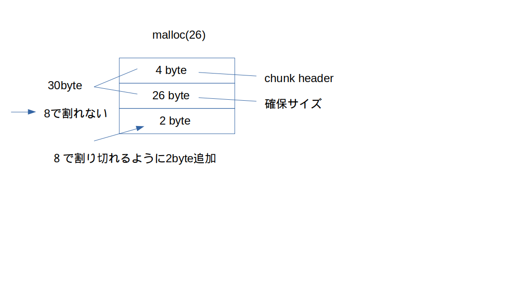

# 内容

```bash
sh memcpy@pwnable.kr -p2222
memcpy@pwnable.kr's password:
 ____  __    __  ____    ____  ____   _        ___      __  _  ____
|    \|  |__|  ||    \  /    ||    \ | |      /  _]    |  |/ ]|    \
|  o  )  |  |  ||  _  ||  o  ||  o  )| |     /  [_     |  ' / |  D  )
|   _/|  |  |  ||  |  ||     ||     || |___ |    _]    |    \ |    /
|  |  |  `  '  ||  |  ||  _  ||  O  ||     ||   [_  __ |     \|    \
|  |   \      / |  |  ||  |  ||     ||     ||     ||  ||  .  ||  .  \
|__|    \_/\_/  |__|__||__|__||_____||_____||_____||__||__|\_||__|\_|

- Site admin : daehee87.kr@gmail.com
- IRC : irc.netgarage.org:6667 / #pwnable.kr
- Simply type "irssi" command to join IRC now
- files under /tmp can be erased anytime. make your directory under /tmp
- to use peda, issue `source /usr/share/peda/peda.py` in gdb terminal
Last login: Fri Aug  9 23:20:08 2019 from 13.54.139.23
memcpy@prowl:~$ ls
memcpy.c  readme
memcpy@prowl:~$ cat readme
the compiled binary of "memcpy.c" source code (with real flag) will be executed under memcpy_pwn privilege if you connect to port 9022.
execute the binary by connecting to daemon(nc 0 9022).

memcpy@prowl:~$ cat memcpy.c
// compiled with : gcc -o memcpy memcpy.c -m32 -lm
#include <stdio.h>
#include <string.h>
#include <stdlib.h>
#include <signal.h>
#include <unistd.h>
#include <sys/mman.h>
#include <math.h>

unsigned long long rdtsc(){
        asm("rdtsc");
}

char* slow_memcpy(char* dest, const char* src, size_t len){
        int i;
        for (i=0; i<len; i++) {
                dest[i] = src[i];
        }
        return dest;
}

char* fast_memcpy(char* dest, const char* src, size_t len){
        size_t i;
        // 64-byte block fast copy
        if(len >= 64){
                i = len / 64;
                len &= (64-1);
                while(i-- > 0){
                        __asm__ __volatile__ (
                        "movdqa (%0), %%xmm0\n"
                        "movdqa 16(%0), %%xmm1\n"
                        "movdqa 32(%0), %%xmm2\n"
                        "movdqa 48(%0), %%xmm3\n"
                        "movntps %%xmm0, (%1)\n"
                        "movntps %%xmm1, 16(%1)\n"
                        "movntps %%xmm2, 32(%1)\n"
                        "movntps %%xmm3, 48(%1)\n"
                        ::"r"(src),"r"(dest):"memory");
                        dest += 64;
                        src += 64;
                }
        }

        // byte-to-byte slow copy
        if(len) slow_memcpy(dest, src, len);
        return dest;
}

int main(void){

        setvbuf(stdout, 0, _IONBF, 0);
        setvbuf(stdin, 0, _IOLBF, 0);

        printf("Hey, I have a boring assignment for CS class.. :(\n");
        printf("The assignment is simple.\n");

        printf("-----------------------------------------------------\n");
        printf("- What is the best implementation of memcpy?        -\n");
        printf("- 1. implement your own slow/fast version of memcpy -\n");
        printf("- 2. compare them with various size of data         -\n");
        printf("- 3. conclude your experiment and submit report     -\n");
        printf("-----------------------------------------------------\n");

        printf("This time, just help me out with my experiment and get flag\n");
        printf("No fancy hacking, I promise :D\n");

        unsigned long long t1, t2;
        int e;
        char* src;
        char* dest;
        unsigned int low, high;
        unsigned int size;
        // allocate memory
        char* cache1 = mmap(0, 0x4000, 7, MAP_PRIVATE|MAP_ANONYMOUS, -1, 0);
        char* cache2 = mmap(0, 0x4000, 7, MAP_PRIVATE|MAP_ANONYMOUS, -1, 0);
        src = mmap(0, 0x2000, 7, MAP_PRIVATE|MAP_ANONYMOUS, -1, 0);

        size_t sizes[10];
        int i=0;

        // setup experiment parameters
        for(e=4; e<14; e++){    // 2^13 = 8K
                low = pow(2,e-1);
                high = pow(2,e);
                printf("specify the memcpy amount between %d ~ %d : ", low, high);
                scanf("%d", &size);
                if( size < low || size > high ){
                        printf("don't mess with the experiment.\n");
                        exit(0);
                }
                sizes[i++] = size;
        }

        sleep(1);
        printf("ok, lets run the experiment with your configuration\n");
        sleep(1);

        // run experiment
        for(i=0; i<10; i++){
                size = sizes[i];
                printf("experiment %d : memcpy with buffer size %d\n", i+1, size);
                dest = malloc( size );

                memcpy(cache1, cache2, 0x4000);         // to eliminate cache effect
                t1 = rdtsc();
                slow_memcpy(dest, src, size);           // byte-to-byte memcpy
                t2 = rdtsc();
                printf("ellapsed CPU cycles for slow_memcpy : %llu\n", t2-t1);

                memcpy(cache1, cache2, 0x4000);         // to eliminate cache effect
                t1 = rdtsc();
                fast_memcpy(dest, src, size);           // block-to-block memcpy
                t2 = rdtsc();
                printf("ellapsed CPU cycles for fast_memcpy : %llu\n", t2-t1);
                printf("\n");
        }

        printf("thanks for helping my experiment!\n");
        printf("flag : ----- erased in this source code -----\n");
        return 0;
}

memcpy@prowl:~$
```

何やら、ncで9022番に接続しろって言ってるのでやってみる。

```bash
pwnable.kr 9022
Hey, I have a boring assignment for CS class.. :(
The assignment is simple.
-----------------------------------------------------
- What is the best implementation of memcpy?        -
- 1. implement your own slow/fast version of memcpy -
- 2. compare them with various size of data         -
- 3. conclude your experiment and submit report     -
-----------------------------------------------------
This time, just help me out with my experiment and get flag
No fancy hacking, I promise :D
specify the memcpy amount between 8 ~ 16 : 8
specify the memcpy amount between 16 ~ 32 : 9
don't mess with the experiment.
memcpy@prowl:~$ nc pwnable.kr 9022
Hey, I have a boring assignment for CS class.. :(
The assignment is simple.
-----------------------------------------------------
- What is the best implementation of memcpy?        -
- 1. implement your own slow/fast version of memcpy -
- 2. compare them with various size of data         -
- 3. conclude your experiment and submit report     -
-----------------------------------------------------
This time, just help me out with my experiment and get flag
No fancy hacking, I promise :D
specify the memcpy amount between 8 ~ 16 : 8
specify the memcpy amount between 16 ~ 32 : 16
specify the memcpy amount between 32 ~ 64 : 32
specify the memcpy amount between 64 ~ 128 : 64
specify the memcpy amount between 128 ~ 256 : 128
specify the memcpy amount between 256 ~ 512 : 256
specify the memcpy amount between 512 ~ 1024 : 512
specify the memcpy amount between 1024 ~ 2048 : 1024
specify the memcpy amount between 2048 ~ 4096 : 2048
specify the memcpy amount between 4096 ~ 8192 : 4098
ok, lets run the experiment with your configuration
experiment 1 : memcpy with buffer size 8
ellapsed CPU cycles for slow_memcpy : 2712
ellapsed CPU cycles for fast_memcpy : 252

experiment 2 : memcpy with buffer size 16
ellapsed CPU cycles for slow_memcpy : 324
ellapsed CPU cycles for fast_memcpy : 238

experiment 3 : memcpy with buffer size 32
ellapsed CPU cycles for slow_memcpy : 430
ellapsed CPU cycles for fast_memcpy : 462

experiment 4 : memcpy with buffer size 64
ellapsed CPU cycles for slow_memcpy : 626
ellapsed CPU cycles for fast_memcpy : 180

experiment 5 : memcpy with buffer size 128
ellapsed CPU cycles for slow_memcpy : 1252
memcpy@prowl:~$
```

一見エラーが出力されていないので成功しているように見えるが、
ソースコードと照らし合わせると、for文が途中で終わっていることがわかる。
要は何かしらの失敗をしている。

また、ソースコードではfor文が終わったあとに、flagが出現すると書いてあるので、
この問題は、エラーを回避することでflagを得ることができるみたい。

# ソースコードを読む
このプログラムは要約すると、２種類の配列のコピーの速度を測っている。

最初から読み解いていくと、まずは配列の動的確保をしていることがわかる。

```c
	char* cache1 = mmap(0, 0x4000, 7, MAP_PRIVATE|MAP_ANONYMOUS, -1, 0);
	char* cache2 = mmap(0, 0x4000, 7, MAP_PRIVATE|MAP_ANONYMOUS, -1, 0);
	src = mmap(0, 0x2000, 7, MAP_PRIVATE|MAP_ANONYMOUS, -1, 0);
```

普通、動的確保ではmallocを用いるが、mmapを使用している。
理由は知らない。
因みに、mallocの中ではmmapが実行されている。

* mmapで動的確保するときは"MAP_PRIVATE|MAP_ANONYMOU"を指定する。

mmapについての説明はmamを参照したほうが良い。
今回の話では動的確保しましたってことだけ、わかれば良いと思う。
特に深く考える必要はない。

さて、次に行っていることは、動的確保した配列をコピーするサイズの指定。
ここだけ読むと、そう読み取れないかもしれないけど、次を見ればわかるはず。

```c
	// setup experiment parameters
	for(e=4; e<14; e++){	// 2^13 = 8K
		low = pow(2,e-1);
		high = pow(2,e);
		printf("specify the memcpy amount between %d ~ %d : ", low, high);
		scanf("%d", &size);
		if( size < low || size > high ){
			printf("don't mess with the experiment.\n");
			exit(0);
		}
		sizes[i++] = size;
	}
```

そんで、最後が、動的確保した配列のコピー。

```c
for(i=0; i<10; i++){
		size = sizes[i];
		printf("experiment %d : memcpy with buffer size %d\n", i+1, size);
		dest = malloc( size );

		memcpy(cache1, cache2, 0x4000);		// to eliminate cache effect
		t1 = rdtsc();
		slow_memcpy(dest, src, size);		// byte-to-byte memcpy
		t2 = rdtsc();
		printf("ellapsed CPU cycles for slow_memcpy : %llu\n", t2-t1);

		memcpy(cache1, cache2, 0x4000);		// to eliminate cache effect
		t1 = rdtsc();
		fast_memcpy(dest, src, size);		// block-to-block memcpy
		t2 = rdtsc();
		printf("ellapsed CPU cycles for fast_memcpy : %llu\n", t2-t1);
		printf("\n");
	}
```

rdtsc()はただのタイムスタンプ。
x86にはrdtscという命令があり、Read Time-Stamp Counterの略
time()みたいなもの？

slow_memcpy()はただ、配列をfor文で回してコピしている関数。
```c
char* slow_memcpy(char* dest, const char* src, size_t len){
	int i;
	for (i=0; i<len; i++) {
		dest[i] = src[i];
	}
	return dest;
}
```

それで、最後にfast_memcpy()。
正直何してるかよくわからん。というか、movdqa、movntpsって命令セットを知らない・・・。
movって書いてあるから、何かのコピーをしているのはわかる。
いずれにこの関数は怪しい。
この関数の話は次にする。

# 問題の特定
プログラムの全体像を掴んだところで問題を特定する。
問題を特定するときはプログラムが実行終了した時の最後を見るのが好ましい。
エラーで止まったらなおさらね。
この観点で見ていくと、fast_memcpy()が怪しいことがわかる。
理由はncで接続したとき、文字列"ellapsed CPU cycles for slow_memcpy : 1252"が二回出ていないから。

fast_memcpy()は関数名と引数から、あるデータをコピーしていることがわかる。
早速、アセンブラを解読していこう。

```c
char* fast_memcpy(char* dest, const char* src, size_t len){
        size_t i;
        // 64-byte block fast copy
        if(len >= 64){
                i = len / 64;
                len &= (64-1);
                while(i-- > 0){
                        __asm__ __volatile__ (
                        "movdqa (%0), %%xmm0\n"
                        "movdqa 16(%0), %%xmm1\n"
                        "movdqa 32(%0), %%xmm2\n"
                        "movdqa 48(%0), %%xmm3\n"
                        "movntps %%xmm0, (%1)\n"
                        "movntps %%xmm1, 16(%1)\n"
                        "movntps %%xmm2, 32(%1)\n"
                        "movntps %%xmm3, 48(%1)\n"
                        ::"r"(src),"r"(dest):"memory"); // %0＝src, %1 ＝destになる。詳しくは__asm__を参照すると良い
                        dest += 64;
                        src += 64;
                }
        }

        // byte-to-byte slow copy
        if(len) slow_memcpy(dest, src, len);
        return dest;
}
```

まず、movdqaとmovntpsについてだが、北陸先端科学技術大学院のサイトに書いてあった。
これらは、SSEと呼ばれる、intel系CPUの拡張命令セットの一つらしい。

* movdqa
* 正式名称はMove Aligned Double Quadword。

[http://www.jaist.ac.jp/iscenter-new/mpc/altix/altixdata/opt/intel/vtune/doc/users_guide/mergedProjects/analyzer_ec/mergedProjects/reference_olh/mergedProjects/instructions/instruct32_hh/vc183.htm](http://www.jaist.ac.jp/iscenter-new/mpc/altix/altixdata/opt/intel/vtune/doc/users_guide/mergedProjects/analyzer_ec/mergedProjects/reference_olh/mergedProjects/instructions/instruct32_hh/vc183.htm)

```text
Moves a double quadword from the source operand (second operand) to the destination operand (first operand). This instruction can be used to move a double quadword to and from an XMM register and a 128-bit memory location, or between two XMM registers. When the source or destination operand is a memory operand, the operand must be aligned on a 16-byte boundary or a general-protection exception (#GP) will be generated.

To move a double quadword to or from unaligned memory locations, use the MOVDQU instruction.

While executing in 16-bit addressing mode, a linear address for a 128-bit data access that overlaps the end of a 16-bit segment is not allowed and is defined as reserved behavior. A specific processor implementation may or may not generate a #GP exception in this situation, and the address that spans the end of the segment may or may not wrap around to the beginning of the segment.
```

* movntps
* 正式名称はMove Aligned Four Packed Single-FP Non Temporal

[http://www.jaist.ac.jp/iscenter-new/mpc/altix/altixdata/opt/intel/vtune/doc/users_guide/mergedProjects/analyzer_ec/mergedProjects/reference_olh/mergedProjects/instructions/instruct32_hh/vc197.htm](http://www.jaist.ac.jp/iscenter-new/mpc/altix/altixdata/opt/intel/vtune/doc/users_guide/mergedProjects/analyzer_ec/mergedProjects/reference_olh/mergedProjects/instructions/instruct32_hh/vc197.htm)

```text
Moves the double quadword in the source operand (second operand) to the destination operand (first operand) using a non-temporal hint to minimize cache pollution during the write to memory. The source operand is an XMM register, which is assumed to contain four packed single-precision floating-point values. The destination operand is a 128-bit memory location.

The non-temporal hint is implemented by using a write combining (WC) memory type protocol when writing the data to memory. Using this protocol, the processor does not write the data into the cache hierarchy, nor does it fetch the corresponding cache line from memory into the cache hierarchy. The memory type of the region being written to can override the non-temporal hint, if the memory address specified for the non-temporal store is in an uncacheable (UC) or write protected (WP) memory region.

Because the WC protocol uses a weakly-ordered memory consistency model, a fencing operation such as SFENCE should be used in conjunction with MOVNTDQ instructions if multiple processors might use different memory types to read/write the memory location.
```

movdqaは128ビットのコピーをすることができる。
ただし、オペランドが16ビットにアライメントされていない場合、例外が発生する。
movntpsはキャッシュへの書き込みをせずに128ビットのコピーができる。
ただし、こちらもオペランドが１６ビットにアライメントされていない場合、例外が発生する。
* アライメント　：　データが入っているアドレスは、**アドレス mod データの型サイズ(int とか doubleなど) = 0** にならないといけない。

では、次にそのオペランドが１６ビットになっているか確認する.
このオペランドの値はもともと、mallocから取得している。

```c

                dest = malloc( size );
```

mallocはご存知の通り、動的に配列を確保する関数。
このmallocについて調べると、新たに以下のことが判明した。
* malloc(size)で確保するサイズは実際にはsize＋4になる
* この+4はmallocのヘッダによるもの。いわゆるchunkヘッダと呼ばれるもの
* mallocのアライメントは関数の実装、または、アーキテクチャによって変わる
* 基本的には64bitcpuでは16byteに、32bitcpuでは8byteにアライメントされる

以下、malloc、ヒープについての話。

[https://qiita.com/kaityo256/items/ca54b1b921d8ab96cb82](https://qiita.com/kaityo256/items/ca54b1b921d8ab96cb82)

以下、mallocのアライメントについてのmicrosoftのdocとstackoverflowの質問。

[https://docs.microsoft.com/ja-jp/cpp/c-runtime-library/reference/malloc?view=vs-2019](https://docs.microsoft.com/ja-jp/cpp/c-runtime-library/reference/malloc?view=vs-2019)
[https://stackoverflow.com/questions/5061392/aligned-memory-management](https://stackoverflow.com/questions/5061392/aligned-memory-management)

例として、malloc(26)をしたときのヒープ領域を図示してみた



なので、もし、ncで接続したサーバーの実行プログラムにおいて、mallocで確保したアドレスが関数の実装及び、アーキテクチャによって8byteにアライメントされている場合、
movdqa、またはmovntpsで例外が発生する。
逆に言えば、mallocで確保したサイズが16で割れれば、例外は発生しなということになる。

# 解答
では、実際にmallocで指定したサイズが16で割れるように、計算してみる。
1. 8~16 : 10[input size] + 4[chunk size]=11[byte]を8バイトで割り切れるようにする  → 16
2. 16~32 : 27[input size] + 4[chunk size]=31[byte]を８バイトで割り切れるようにする　→ 32
3. 32~64 : 43[input size] + 4[chunk size]=47[byte]を８バイトで割り切れるようにする　→ 48
4. 64~128 : 72[input size] + 4[chunk size]=76[byte]を８バイトで割り切れるようにする　→ 80
5. 128~256 : 139[input size] + 4[chunk size]=143[byte]を８バイトで割り切れるようにする　→ 144
6. 256~512 : 265[input size] + 4[chunk size]=269[byte]を８バイトで割り切れるようにする　→ 272
7. 512~1024 : 522[input size] + 4[chunk size]=526[byte]を８バイトで割り切れるようにする　→ 528
8. 1024~2048: 1032[input size] + 4[chunk size]=1036[byte]を８バイトで割り切れるようにする　→ 1040
9. 2048~4096: 2060[input size] + 4[chunk size]=2064[byte]を８バイトで割り切れるようにする　→ 2068
10. 4096~8192 : 4102[input size] + 4[chunk size]=4106[byte]を８バイトで割り切れるようにする　→ 4112

実際に入力してみる。

```bash
pwnable.kr 9022
Hey, I have a boring assignment for CS class.. :(
The assignment is simple.
-----------------------------------------------------
- What is the best implementation of memcpy?        -
- 1. implement your own slow/fast version of memcpy -
- 2. compare them with various size of data         -
- 3. conclude your experiment and submit report     -
-----------------------------------------------------
This time, just help me out with my experiment and get flag
No fancy hacking, I promise :D
specify the memcpy amount between 8 ~ 16 : 10
specify the memcpy amount between 16 ~ 32 : 27
specify the memcpy amount between 32 ~ 64 : 43
specify the memcpy amount between 64 ~ 128 : 72
specify the memcpy amount between 128 ~ 256 : 139
specify the memcpy amount between 256 ~ 512 : 265
specify the memcpy amount between 512 ~ 1024 : 522
specify the memcpy amount between 1024 ~ 2048 : 1032
specify the memcpy amount between 2048 ~ 4096 : 2060
specify the memcpy amount between 4096 ~ 8192 : 4102
ok, lets run the experiment with your configuration
experiment 1 : memcpy with buffer size 10
ellapsed CPU cycles for slow_memcpy : 2406
ellapsed CPU cycles for fast_memcpy : 238

experiment 2 : memcpy with buffer size 27
ellapsed CPU cycles for slow_memcpy : 366
ellapsed CPU cycles for fast_memcpy : 368

experiment 3 : memcpy with buffer size 43
ellapsed CPU cycles for slow_memcpy : 434
ellapsed CPU cycles for fast_memcpy : 406

experiment 4 : memcpy with buffer size 72
ellapsed CPU cycles for slow_memcpy : 694
ellapsed CPU cycles for fast_memcpy : 226

experiment 5 : memcpy with buffer size 139
ellapsed CPU cycles for slow_memcpy : 1174
ellapsed CPU cycles for fast_memcpy : 216

experiment 6 : memcpy with buffer size 265
ellapsed CPU cycles for slow_memcpy : 2154
ellapsed CPU cycles for fast_memcpy : 292

experiment 7 : memcpy with buffer size 522
ellapsed CPU cycles for slow_memcpy : 4198
ellapsed CPU cycles for fast_memcpy : 338

experiment 8 : memcpy with buffer size 1032
ellapsed CPU cycles for slow_memcpy : 8102
ellapsed CPU cycles for fast_memcpy : 446

experiment 9 : memcpy with buffer size 2060
ellapsed CPU cycles for slow_memcpy : 16154
ellapsed CPU cycles for fast_memcpy : 800

experiment 10 : memcpy with buffer size 4102
ellapsed CPU cycles for slow_memcpy : 34228
ellapsed CPU cycles for fast_memcpy : 1562

thanks for helping my experiment!
```

フラグゲット。
